> All rights reserved by **Hack The Box LTD**.



> Summary

- Exploiting the `CVE-2025-2304` on `CMS Camaleon 2.9.0` to escalate privileges through mass attribute assignment
- Obtaining `API Key` and `Secret Key` via the compromised `CMS`
- Accessing the internal `bucket S3` via `minio-client`, discovering the private key `SSH`
- Exploiting a `Path Traversal` (`CVE-2024-46987`) to read sensitive system files
- Privilege escalation using the `facter` binary with `sudo` permissions
- Security recommendations to prevent and mitigate vulnerabilities on this machine



#### Skills Used

- Port and service enumeration
- Directory and web architecture enumeration
- Exploitation of vulnerabilities in `CMS` (Mass Attribute Assignment)
- Interaction with object storage services (`S3`) via `minio-client`
- Exploitation of binaries with `sudo` permissions

#### Tools Used

- ping
- nmap
- minio-client
- python3
- ssh2john
- john
- curl
- ssh
- facter

------------------------------------------------------------------------

## Vulnerability Assesment and Analysis

The `HTB` platform provides us with the target `IP`, which is `10.129.16.176`—an address that can be reached by connecting through the `VPN` assigned to us by the platform.

We verify whether it is possible to establish a connection between the victim machine and ours:

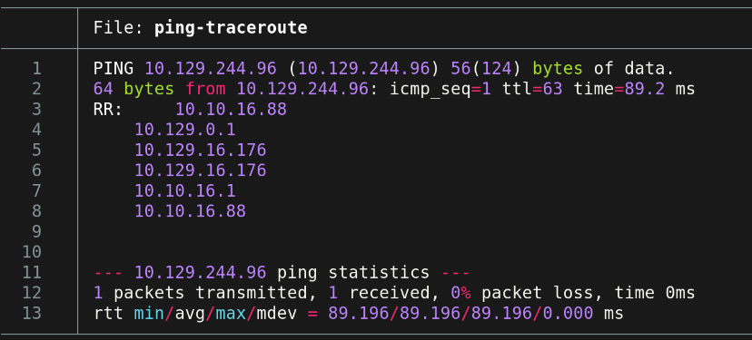

The ICMP trace route is successful. Thus, the TTL value is `63`, which ***could*** indicate that we are dealing with a `Linux/Unix` distribution since it is close to 64.

### Port Scanning

We performed a scan of the system’s 65,535 `TCP` ports using the `Nmap` tool, focusing on those with an open status:

``` bash
nmap -p- --min-rate 5000 -Pn -n -oN nmap-scan 10.129.16.176
```

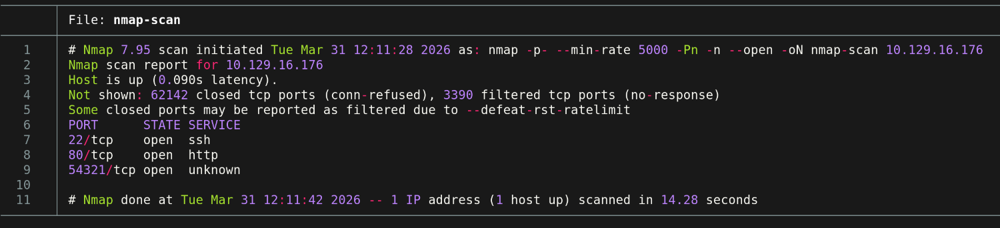

> <= Important => In enterprise environments, sending large numbers of packets to `TCP`, `ICMP`, or `UDP` often causes network congestion, potentially triggering an accidental `DoS` attack or causing the traffic to be blocked by monitoring systems.

### Port Enumeration

We observe that ports 22 `(SSH)`, 80 `(HTTP)`, and 54321 (currently unknown) are active. From this point, we can enumerate the services via `Nmap`.

``` bash
nmap -p22,80,54321 -sCV -oN ports-enum 10.129.16.176
```

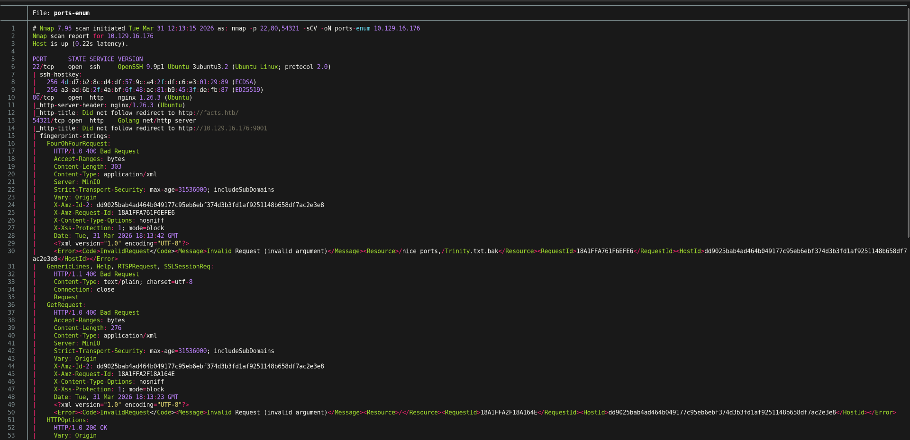

After analyzing the port enumeration, we can summarize the results in the following table:

| Port  | Service |                            Version                            |                                                              Notes                                                              |
|:-----:|:-------:|:-------------------------------------------------------------:|:-------------------------------------------------------------------------------------------------------------------------------:|
|  22   |   ssh   | OpenSSH 8.9p1 Ubuntu 3ubuntu0.13 (Ubuntu Linux; protocol 2.0) | Outdated version and potentially affected by various vulnerabilities (`RCE`, among others). *This is not the primary objective* |
|  80   |  http   |                      Apache httpd 2.4.52                      |     Seriously outdated web service, potentially affected by `CVE-2022-22720` and `CVE-2022-22719`. *Not the primary target*     |
| 54321 |  http   |                    Golang net/http server                     |                                 Possible standard web server or *a cloud object storage system*                                 |

> Tools such as `whatweb` (command-line tool) or `Wappalyzer` (browser extension) are very useful when we want to identify only the technologies used by an HTTP service.

Based on the table, we can define possible approaches to the target:

> - Port 22 (`SSH`): A severely outdated `OpenSSH` service, possibly running on a `Ubuntu 22.04 LTS` distribution (`Jammy Jellyfish`). Potential user enumeration via `CVE-2016-6210` and a `DoS`-type attack (`CVE-2015-5600`). At first glance, these do not appear to be potential direct access paths to the system.
>
> - Port 80 (`HTTP`): Web application hosted via an outdated `Apache httpd 2.4.52` service. Through web enumeration, it is possible to identify other services and potential access points to the victim server.
>
> - Port 54321 (`HTTP`): A `net/http` server written in `Go`. Given its uses, it could be a microservice application, an internal API, or even a tool for cloud storage environments, enabling communication with services such as `S3` for managing `buckets`.

### Web Enumeration

Before accessing the target website `Facts`, a temporary `mapping` is set up from the target IP address to the page. This is done by modifying the file `/etc/hosts`:

``` bash
sudoedit /etc/hosts
```

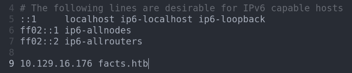

After accessing `facts.htb`, we can see that it is a trivia website.


At first glance, we don’t see any options that would take us to an admin panel or other types of services. Therefore, we perform a URL enumeration using the tool `gobuster` to gain a broader view of the site’s architecture:

``` bash
gobuster dir -w wordlist -u "http://facts.htb"
```

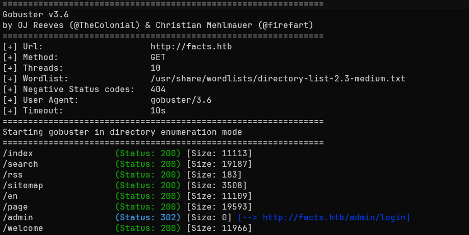

The results indicate the presence of an admin panel at the URL `http://facts.htb/admin/login`. We access it to see what kind of web service it is.

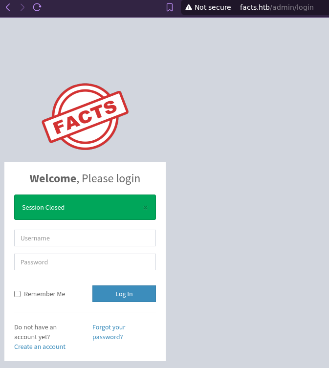

We observe that it is an administration panel provided by `CMS`. Since the option to register an account is enabled, we begin the process.

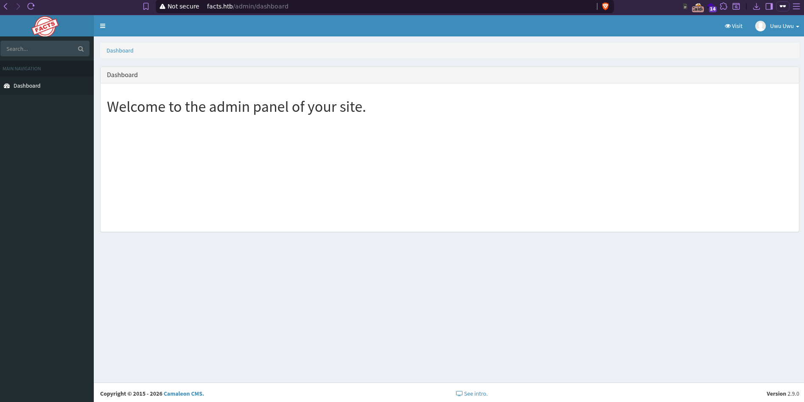

Upon logging in, we notice two items of interest:

|                                     `CMS Camaleon 2.9.0`                                      |                                                      CVE-2025-2304                                                       |
|:---------------------------------------------------------------------------------------------:|:------------------------------------------------------------------------------------------------------------------------:|
| `Camaleon` is a *Content Management System*. This version is affected by the `CVE-2025-2304`. | This vulnerability exploits an `endpoint` called `updated_ajax`, allowing the role of one or more users to be manipulated |

## Exploitation

From this point on, we focus on attempting to gain access to the `Facts` system using various methods.

### Web: CVE-2025-2304

After verifying the existence of a promising attack vector, we used a tool such as `Caido` to capture and manipulate web requests. After activating it, we directed the requests to our user profile on `CMS` and attempted to change our password.

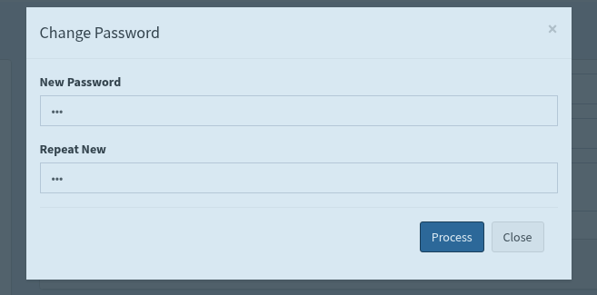

After capturing the request, we modified the `password` parameter by adding `[role]=admin`.

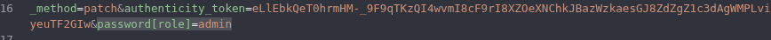

This modification injects the ``role`` parameter into the request body, thereby escalating our account’s privileges to those of a privileged user.

After that, we access the URL `/admin/settings/site` to enter the site’s configuration. Next, we navigate to the section `Filesystem Settings`. Here we can discover that the server runs the `Amazon S3` service for cloud object storage, which operates on port `54321` (previously discovered).

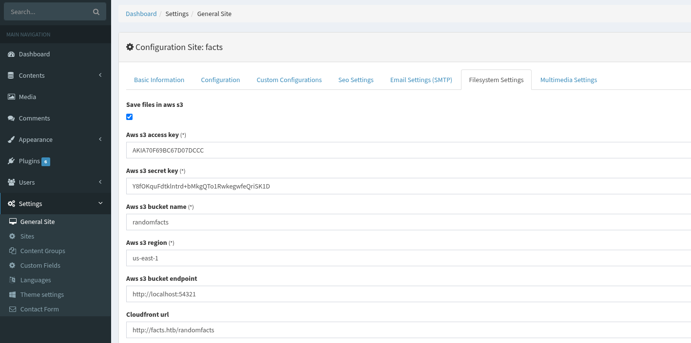

To capitalize on the discovery made at `Filesystem Settings`, we retrieve the `access key` and `secret key`, and then establish a connection to the server via `MiNIO`:

``` bash
minio-client alias set facts_htb http://facts.htb:54321/
```

> - `minio-client`: A dedicated tool for managing and interacting with object storage systems via `Amazon S3`

After running the command, we received the following response: `Added facts_htb successfully`

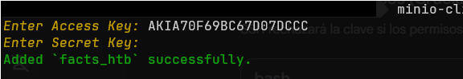

After creating a shortcut to the storage server, we can list the `buckets` and objects within the server; through this capability, we can identify the existence of the *bucket* `internal`, which contains the folder `.ssh`.

We list the contents to search for potentially valuable files:

``` bash
minio-client ls facts_htb/internal/.ssh
```

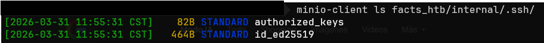

We observe that inside the folder there is a private key (`id_ed25519`) for connections to `SSH`. If this key is protected by a very simple `passphrase`, it can be quickly cracked using a dictionary attack, allowing us to subsequently gain remote access to the target server of interest.

To crack it, we must first convert the key into a hash that can be used by tools such as `John the Ripper` or `Hashcat`. In this case, we’ll use `John`:

``` bash
python3 ssh2john.py id_ed25519 > id.hash
```

> Link to the utility: <https://github.com/openwall/john/blob/bleeding-jumbo/run/ssh2john.py>

After that, we’ll proceed to crack it:

``` bash
john --wordlist=/usr/share/wordlist/rockyou.txt id.hash
```

> - `john`: A tool for decrypting and auditing passwords.
> - `--wordlist=path/to/wordlist`: A dictionary of words or combinations used for the comparison process with the file hash.
> - `<fileHash-to-crack>`: Irreversibly encrypted password.

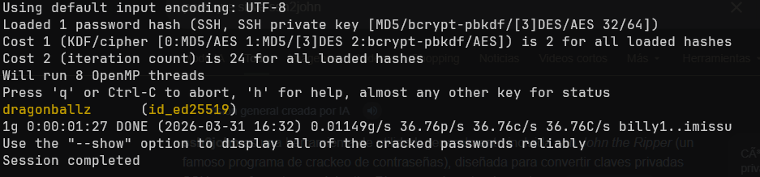

After discovering the *passphrase*, we need to identify the user who owns the private key `SSH`.

### Web: CVE-2024-46987

In specific variants of `Camaleon v2.9.0`, it is possible to perform a `Path Traversal`, allowing us to access remote files on the victim server, such as `/etc/passwd`.

If we wish to carry out the exploit via `CLI`, we can run the following command:

``` bash
curl --cookie "_factsapp_session=Cookie ; auth_token=Cookie" "http://facts.htb/admin/media/download_private_file?file=../../../../../../../etc/passwd" | grep "bash"
```

> - `-b` / `--cookie`: ability to inject one or more `cookies` session tokens

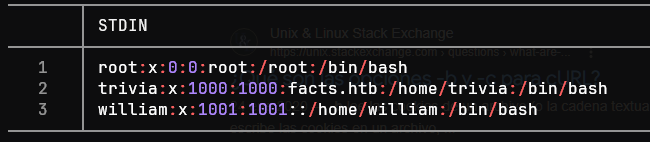

We can see that there are 3 existing users on the machine: `root`, `trivia`, and `william`.

### SSH

By performing a `password spraying` on the three existing users, we discovered that the cracked password belongs to the user `trivia`. After that, we logged in as `SSH`:

``` bash
ssh -i id_ed25519 trivia@10.129.16.176 #dragonballz
```

After logging in, we listed the commands we can execute with the privileges of the user `root`:

``` bash
sudo -l
```

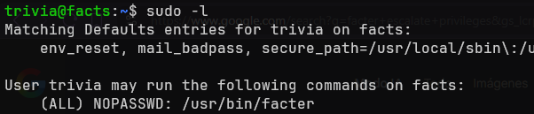

We observed that we have the ability to execute the command `facter` (a tool designed to list a large amount of data about the system in use).

Upon investigating `GTFOBins`, we found that the command ``facter`` allows us to run _custom_ scripts written in `Ruby`.

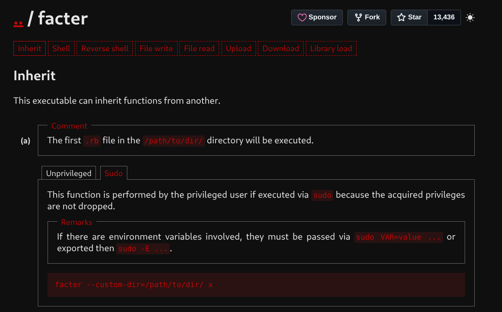

To exploit this, we used the `--custom-dir` flag to abuse this feature and wrote the malicious script:

``` bash
echo "require 'facter'; Facter.add(:get_bash){setcode{system('/bin/bash')}}" > exploit.rb
sudo facter --custom-dir /tmp get_bash
```

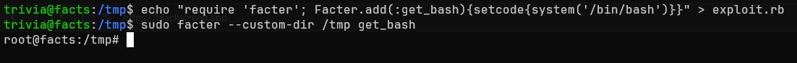

We now have a `bash` session as the user `root`, giving us full control of the `Facts` system.

## Impact

An attacker with the permissions of a regular user such as `trivia` is capable of:

> - Execute `scripts` and establish persistent sessions.
> - Ability to enumerate other systems on the network and perform lateral movement.

An attacker with administrator privileges gains the following capabilities:

> - Establish persistence across sessions and control server traffic.
> - Exfiltrate sensitive data (database or internal storage via `S3/MinIO`).
> - Manipulating ``cronjobs`` to execute malicious tasks.
> - Installing `backdoors` at the kernel level.

# Summary

The `Facts` machine exhibited a series of critical vulnerabilities (**not all of which** **are detailed in this write-up**), such as a `Path Traversal` followed by a `RCE`, as well as a `Credential Reuse` and an `SUID` exploit, among others. Therefore, the following sections will outline the findings, their severity, and guidelines for preventing this type of security breach.

### Findings

> Mass Attribute Assignment and Privilege Escalation on `CMS Camaleon`

| ID  |                          **Vulnerability**                          |            **Threat Level**            |                                                                              Description                                                                               |
|:---:|:-------------------------------------------------------------------:|:----------------------------------:|:----------------------------------------------------------------------------------------------------------------------------------------------------------------------:|
| MF1 | CWE-915: Improper Modification of Dynamically Determined Attributes |  Critical  | `CMS` does not properly validate the request `POST` when changing a password, allowing injection of the parameter `role` to escalate privileges to administrator level |

 Immediate Measures

> - Immediately update the `CMS Camaleon` system to a patched version supported by the client.
> - Implement server-side measures `Zero Trust` to ignore or reject unauthorized parameters during user profile updates (`whitelisting`).
> - Strictly limit user creation if interaction with external users is not required.



> Insecure Storage of Cryptographic Keys and Use of Weak Passwords

| ID  |                                        **Vulnerability**                                        |          **Threat Level**          |                                                                   Description                                                                    |
|:---:|:-----------------------------------------------------------------------------------------------:|:------------------------------:|:------------------------------------------------------------------------------------------------------------------------------------------------:|
| MF2 | CWE-1391 and CWE-312: Use of Weak Credentials and Storage of Sensitive Information in Plaintext |  High  | Exposure of the SSH private key `id_ed25519` on the local `bucket S3`, which is in turn protected by a password vulnerable to dictionary attacks |

 Immediate Measures

> - Implement strict read permissions for the internal `S3` bucket, limiting access exclusively to essential services and `IP` addresses through a strict `Firewall`.
> - Revoke the compromised SSH key and generate a new key pair using a strong `passphrase` (minimum 16 characters, *including* alphanumeric characters and symbols).
> - Avoid storing cryptographic keys in shared object storage services.



> Exposure of Sensitive Files via `Path Traversal`

| ID  |                            **Vulnerability**                            |           **Threat Level**           |                                                         Description                                                         |
|:---:|:-----------------------------------------------------------------------:|:--------------------------------:|:---------------------------------------------------------------------------------------------------------------------------:|
| MF3 | CWE-22: Inadequate Restriction of a Path Name to a Restricted Directory |  High  | The private file download endpoint allows the use of `../`, exposing critical operating system files such as `/etc/passwd`. |

 Immediate Measures

> - Implement strict validation and sanitization of the `file` parameter, restricting special character sequences such as `../` and `%2e%2e%2f`.
> - Verify that the entered absolute path requests files within allowed directories before processing the requested file.



> Inadequate Management of Sudo Privileges

| ID  |          **Threat Level**           |             **Severity**             |                                                                         Description                                                                          |
|:---:|:------------------------------------:|:------------------------------------:|:------------------------------------------------------------------------------------------------------------------------------------------------------------:|
| MF4 | CWE-269: Improper Privilege Handling |  Critical  | A user with the `trivia` permission can execute the binary `facter` as `root`, allowing Ruby code injection and thus executing commands as an administrator. |

 Immediate Measures

> - Remove the binary `facter` from the passwordless execution permissions directives for the user `trivia` in the file `/etc/sudoers`.
> - If execution is part of the business logic, create an intermediary `wrapper` that limits and validates arguments entered by the user `trivia` to prevent dangerous arguments such as `--custom-dir`.
> - Periodically audit the configuration file `sudoers`, verifying that the principle of least privilege is followed.


